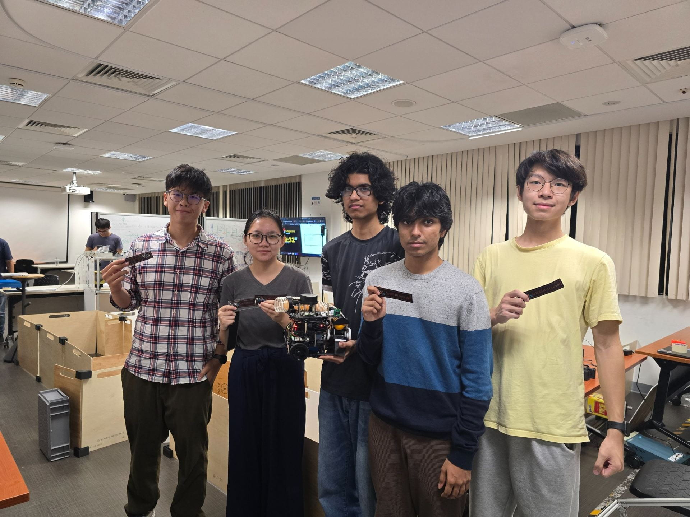

# CDE2310 System Engineering - AY2526 Group 3

- **Team Member:** Chen Shimin, Seow Cheng Si, Arnav Jhajharia, Abhinandan Shrimal, Daphne Shaine Wilhelmina
- **Final Grade: A-**

An autonomous TurtleBot3-based delivery robot built for the CDE2310/EG2310 robotics course at the National University of Singapore.

The robot was designed to explore an unknown maze, identify two target stations, dock using visual feedback, align a ping-pong-ball launcher with each receptacle, and fire three balls per station within a 25-minute mission window.

Course page: [CDE2310/EG2310 AY2526](https://blog.nus.edu.sg/eg2310/2026-2/)

## Final Run (14 April 2026, Week 13 Tue)

- [Final run screen recording, part 1](https://www.youtube.com/watch?v=hjtmTSh4A78)
- [Final run screen recording, part 2](https://www.youtube.com/watch?v=OZwQptIx55s)

The final run did not reflect the system we hoped to demonstrate. Our team ended up with the lowest final-run score, mainly because the frontier mapping and Nav2 mission flow did not come together reliably during full-system integration. That result was disappointing, but it also made the project a useful record of what worked, what did not, and what we would do differently.

Despite the difficult final demonstration, the project was still valuable. I eventually received an A- for the course, and I suspect the documentation and engineering reflection captured in this repository helped compensate for the weak final run. I entered the course without a Nav2 background, and the work here gave me practical experience with ROS 2 navigation, frontier exploration, simulation, robot networking, and system integration. That experience later helped me secure my first robotics-navigation internship at [Griffin Labs](https://griffinlabs.ai/). The course experience was rough, but the learning was real.

- Frontier Exploration Demo In Simulation (20 March 2026, Week 9 Fri)

https://github.com/user-attachments/assets/755e566e-a58e-4059-8860-4c8718844997

- Turtlebot Navigation Demo Video (21 March 2026, Week 9 Sat)

https://github.com/user-attachments/assets/281b9f60-19b3-4af7-8525-cc15e1a01227

## System Overview

The platform extends a TurtleBot3 Burger with a Raspberry Pi, LiDAR, USB/RPi camera sensing, a custom mechanical ball launcher, and ROS 2 software running across robot and laptop/container environments.

At a high level, the system is organized into:

| Layer | Main components | Purpose |
| --- | --- | --- |
| Mission control | `g3_mission_control` | Finite-state mission sequencing, retries, station tracking, launcher coordination |
| Navigation | Nav2, SLAM, `g3g_frontier_exploration`, `g3nav2` | Autonomous exploration, path planning, obstacle avoidance, hardware Nav2 configuration |
| Perception and docking | `g3_visual_servo`, ArUco markers, station aligners | Station detection, short-range docking, receptacle alignment |
| Actuation | `g3_ball_launcher`, TurtleBot3 motor control | UART servo-based ball launching and base motion |
| Simulation and assets | `g3gzsim`, Gazebo Harmonic worlds, CAD files | Local testing, subsystem validation, mechanical design references |

The final mission concept was:

1. Start the robot and verify required services.
2. Explore the unknown arena using frontier-based exploration.
3. Detect Station A or Station B using ArUco markers.
4. Pause exploration and dock using visual servoing.
5. Align the launcher to the receptacle.
6. Fire three ping-pong balls.
7. Resume exploration until both stations are completed.

## Repository Map

| Path | Description |
| --- | --- |
| [`src/g3_mission_control`](src/g3_mission_control) | Python FSM controllers for the competition mission and simplified debug flow |
| [`src/g3g_frontier_exploration`](src/g3g_frontier_exploration) | Frontier selection and Nav2 goal dispatch for autonomous exploration |
| [`src/g3_visual_servo`](src/g3_visual_servo) | ArUco marker detection, pose publishing, and visual-servo docking experiments |
| [`src/g3_aligner`](src/g3_aligner) | Station alignment nodes using camera feedback and Hough-circle style target detection |
| [`src/g3_ball_launcher`](src/g3_ball_launcher) | Ball launcher node and UART servo SDK |
| [`src/g3gzsim`](src/g3gzsim) | Gazebo worlds, models, RViz configs, and simulation launch files |
| [`src/g3nav2`](src/g3nav2) | Nav2 launch and configuration for TurtleBot3 hardware |
| [`docker`](docker) | Portable ROS 2 Jazzy, Gazebo, Nav2, and Foxglove development environment |
| [`docs`](docs) | Course report pages, development guide, user manual, and subsystem documentation |
| [`obsidian-vault`](obsidian-vault) | Additional architecture notes, package references, and how-to material |
| [`mech`](mech) | Mechanical photos, launcher videos, drawings, and CAD files |

## Quick Start

The recommended development path is the Docker environment, which provides ROS 2 Jazzy, Gazebo Harmonic, Nav2, Cartographer, Foxglove bridge, and TurtleBot3 dependencies.

```bash
docker compose build
docker compose -f docker-compose.yml -f docker-compose.wslg.yml up -d
docker compose -f docker-compose.yml -f docker-compose.wslg.yml exec dev bash
```

Inside the container:

```bash
cd ~/nav_ws
colcon build --symlink-install
source install/setup.bash
ros2 launch g3gzsim nav2full_test_launch.py
```

To activate frontier exploration from another terminal:

```bash
ros2 service call /exploration/set_enabled std_srvs/srv/SetBool "{data: true}"
```

For host-specific setup, real-robot networking, camera launch commands, Foxglove, and Nav2 notes, see the [Development Guide](docs/DevelopmentGuide.md).

## Project Artifacts

- [User Manual](docs/assets/g2-report/Group3_User_Manual.pdf)
- [Development Guide](docs/DevelopmentGuide.md)
- [Architecture Overview](obsidian-vault/architecture/Architecture%20Overview.md)
- [ROS 2 Topic and Service Map](obsidian-vault/architecture/ROS2%20Topic%20and%20Service%20Map.md)
- [Package Index](obsidian-vault/packages/Package%20Index.md)

## Report Pages

- [Requirement Specifications](docs/G2-Requirement-Specifications.md)
- [Con-Ops](docs/G2-Con-Ops.md)
- [High-Level Design](docs/G2-High-Level-Design.md)
- Subsystem Design
  - [Launcher & Servo](docs/G2-Launcher-Servo.md)
  - [Visual Servo & ArUco Docking](docs/G2-Visual-Servo.md)
  - [Autonomous Exploration and Navigation](docs/G2-Autonomous-Exploration-and-Navigation.md)
  - [Receptacle Alignment](docs/G2-Alignment.md)
- [Interface Control Document](docs/G2-Interface-Control-Document.md)
- [Software Development Documentation](docs/G2-Software-Development-Documentation.md)
- [Testing Documentation](docs/G2-Testing-Documentation.md)
- [Areas for Improvement](docs/G2-Areas-for-Improvement.md)

## Mechanical Media

- [Front view](mech/front_view.jpg)
- [Back view](mech/back_view.jpg)
- [Side view](mech/side_view.jpg)
- [Launcher in action](mech/launcher_in_action.mp4)
- [Cam animation](mech/cam_animation.mp4)
- [Mechanical drawings](mech/drawings)
- [CAD files](mech/cad_files)

## Retrospective

Our early progress was stronger than the final result suggests. The team started ahead of average in preparation, assignments, and initial subsystem work. The navigation stack was completed and tested relatively early, and the project also produced a large amount of documentation, simulation work, CAD, and subsystem code.

The main weakness was integration. From around the Preliminary Design Review onward, subsystem maturity and integration pace slowed. Several modules remained too isolated for too long, and we overestimated how naturally the final system would come together. When the final run arrived, the integration quality was not strong enough for the navigation, docking, alignment, and launching chain to perform reliably as one system.

The biggest lessons:

- Treat integration as a first-class task from the beginning, not a final-week activity.
- Define interface specifications, ownership boundaries, and system-level test plans early.
- Prototype a thin end-to-end mission flow before polishing individual subsystems.
- Hold more frequent technical design reviews and reallocate support when a subsystem falls behind.
- Set up Docker, ROS 2 networking, and lab debugging infrastructure early so everyone can test independently.
- Complete the full CAD assembly earlier, including electronics placement and mounting details, to reduce late mechanical redesigns.

The result was imperfect, but the repository preserves both the engineering attempt and the learning process behind it.


