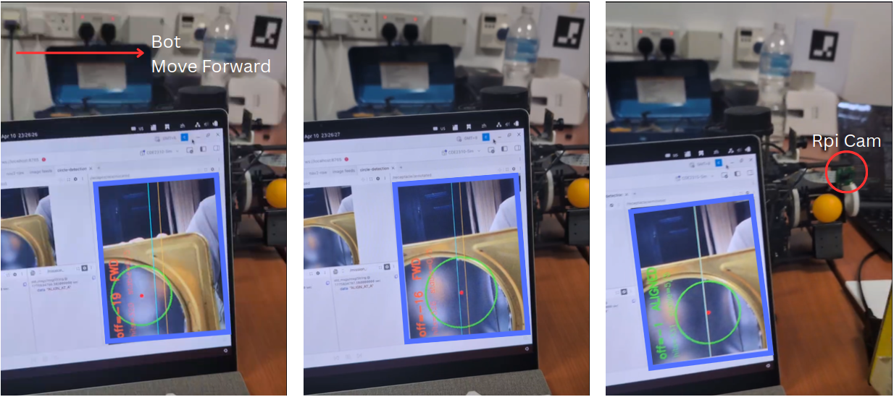
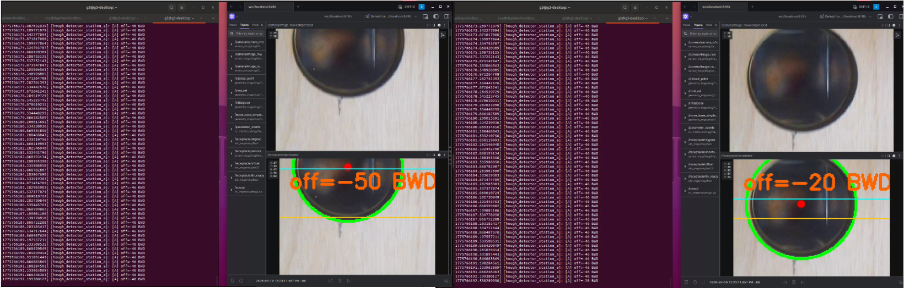
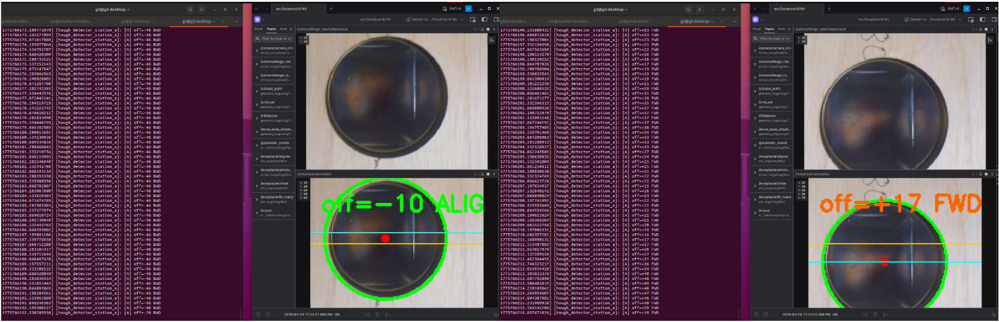
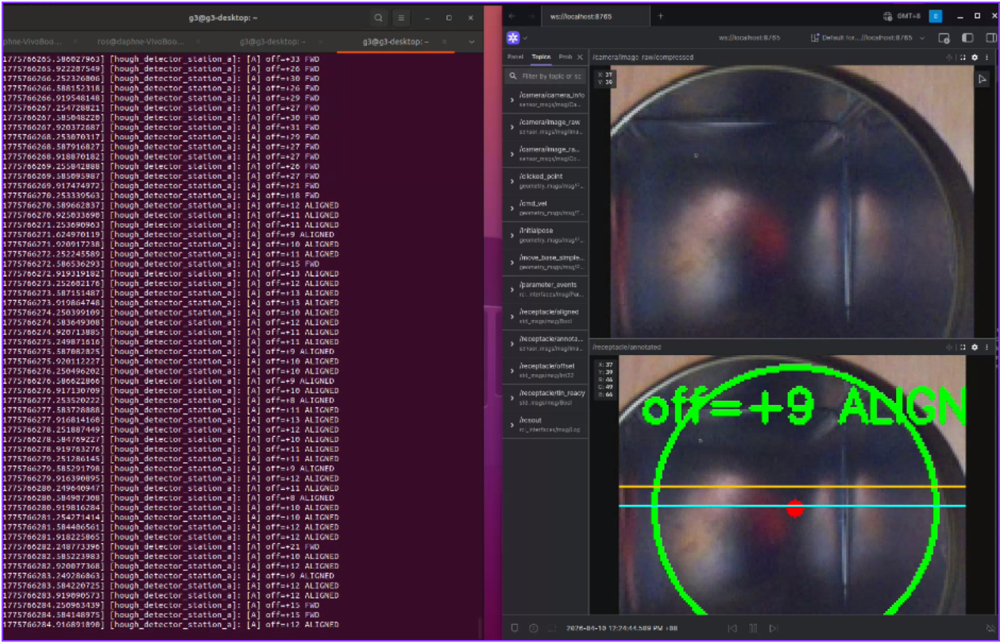
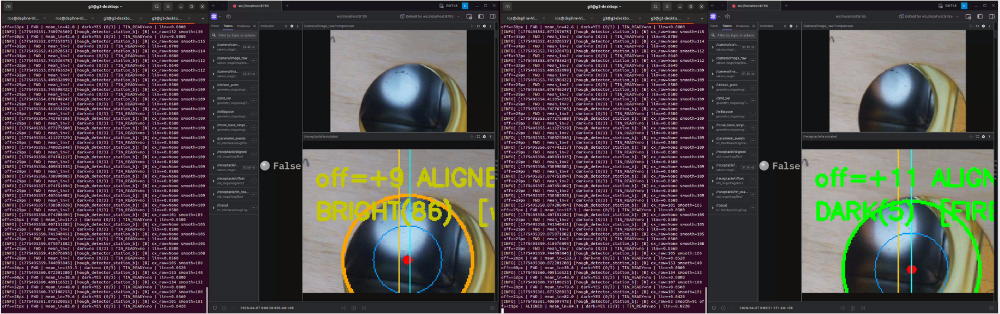
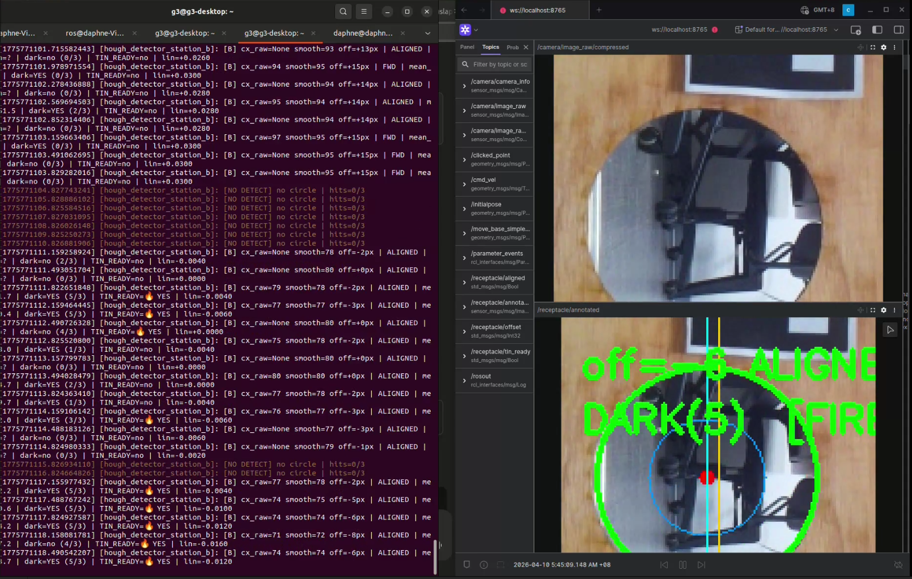

## Receptacle Alignment Subsystem

[Home](../README.md)

### Overview

The alignment subsystem uses the RPi Camera V2 (side-mounted, rotated 90° CCW) to detect the circular tin receptacle opening and align the launcher to it. Two separate nodes handle Station A and Station B respectively, sharing the same Hough-based geometric alignment logic but differing in the fire trigger mechanism.

Camera configuration note: the camera is physically rotated 90° CCW relative to the robot drive axis. Consequently, lateral alignment of the launcher maps to the Y-axis of the camera frame (not X). All offset calculations and P-controller outputs use `cy` (vertical pixel coordinate) rather than `cx`.

Fig: Hough Circle Transform + Y-axis P-control + Ball Launcher (Foxglove)
 

### Station A: Static Receptacle Alignment

Algorithm: Hough Circle Transform + Y-axis P-control

Processing pipeline per frame:

1. Decode compressed image from `/camera/image_raw/compressed`
2. Convert to grayscale → GaussianBlur (11×11, σ=2)
3. HoughCircles (HOUGH_GRADIENT): detect circular tin opening
4. Select largest detected circle (most likely the receptacle)
5. Compute offset_y = cy_detected − (frame_height / 2)
6. Apply EMA smoother: ema_cy = α × cy_raw + (1−α) × ema_cy [α = 0.20]
7. P-control: linear_vel = Kp × offset_y, clamped to ±0.08 m/s
8. Publish `/cmd_vel` (linear.x only; angular.z = 0)
9. Count consecutive aligned frames; at threshold → call `/receptacle/notify_aligned`

Tuned Parameters (physical test: 22–38 cm stand-off):

| Parameter | Value | Effect |
| --- | --- | --- |
| Kp (linear) | 0.0015 | Proportional gain; lower = smoother but slower |
| MAX_LINEAR_VEL | 0.08 m/s | Velocity cap; prevents overshoot at close range |
| ALIGN_THRESHOLD | 15 px | Offset band considered "aligned" |
| ALIGN_STABLE_FRAMES | 5 | Frames alignment must hold before notifying FSM |
| CONFIRM_FRAMES | 5 | Consecutive detections before circle is "confirmed" |
| EMA_ALPHA | 0.20 | Low value = heavy smoothing; reduces jitter |
| MIN_R / MAX_R | 80 / 150 px | Tuned radius window for operating distance |
| PARAM2 (Hough) | 45 | Accumulator threshold; higher = fewer false positives |

Hough Circle Transform + Y-axis P-control (Move Backward) at ~35 cm (Foxglove)

Fig: Hough Circle Transform + Y-axis P-control (Move Forward) at ~35 cm (Foxglove)
 

Fig: Hough Circle Transform + Y-axis P-control (Aligned) at ~35 and ~28 cm (Foxglove)
 

Fig: Hough Circle Transform + Y-axis P-control (Aligned) at ~ 22 cm (Foxglove)
 

### Station B: Moving Receptacle Alignment

Station B presents a moving tin receptacle on a motorised rail. Two sequential phases are used, with the bot freezing permanently after Phase 1.

Phase 1: Geometric Alignment (identical to Station A)

- Y-axis Hough alignment to the wooden cutout hole
- Must hold for 5 consecutive aligned frames → LOCKED
- Once locked, `cmd_vel` is zeroed permanently (bot never moves again)

Phase 2: HSV Blue LED Detection (fire trigger)

- A blue LED is mounted inside the tin receptacle
- When the tin opening aligns with the cutout hole, the LED becomes visible
- Detection uses HSV colour thresholding within the Hough-detected circle ROI: HSV mask parameters: H: 100–130 (blue hue range, OpenCV 0–179 scale) S: 180–255 (high saturation; filters white/ambient light) V: 200–255 (high value; LED is bright emitted light)
- LED detection ratio: blue pixels inside circle / total circle area > 0.10
- Confirmed after 30 consecutive positive frames (debounce against rail vibration)
- Rising edge (LED appears) → call `/fire_launcher` service
- BALLS_TO_FIRE = 1 per rising edge event

Tuned Parameters (physical test: 22–38 cm stand-off):

Most of the params are the same as Station A, some of them differs which shown below

| Parameter | Value | Remarks |
| --- | --- | --- |
| EMA_ALPHA | 0.15 | Station B uses stronger smoothing |
| CONFIRM_FRAMES | 8 | Station B needs more frames to latch |

Why HSV instead of brightness/darkness thresholding? Brightness-based detection failed during testing because:

(a) The tin interior reflects ambient light when behind the cutout, producing similar brightness values to the “not aligned” case.

Fig: Brightness/Darkness Thresholding Issue in Station B (Foxglove)
 

(b) Dark objects behind the cutout created false positives. HSV detection isolates a specific hue, making it robust to ambient illumination changes and background content.

Fig: Darkness Thresholding Issue in Station B (Foxglove)
 
