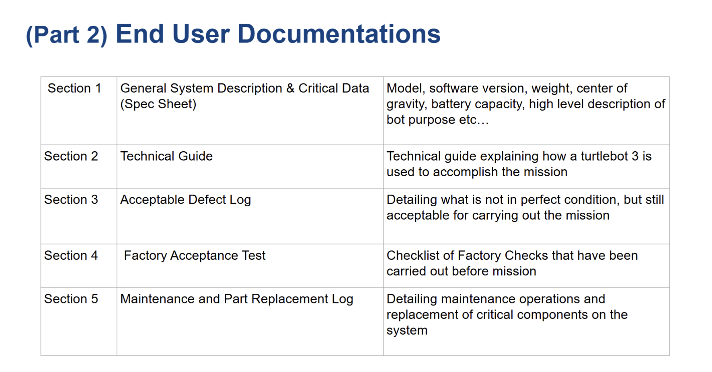

# Areas for Improvement

[Home](../README.md)

## Early System Integration and Compute Resource Planning

Several issues would likely have been detected earlier if all major nodes had been integrated onto the physical robot sooner, even with limited functionality. Earlier full-system testing would have exposed power limitations, CPU contention, interface mismatches, and timing conflicts well before the final mission. During operation, running docking, perception, alignment, and launcher nodes concurrently placed significant computational load on the Raspberry Pi. Future iterations should either migrate heavier vision workloads to a more capable onboard computer or optimise the existing nodes more aggressively to reduce latency and dropped frames.

## Power Management and Electrical Safety

Power management proved to be a major operational concern. The TurtleBot3 battery discharged quickly during repeated motion tests, reducing test duration and occasionally contributing to unstable system behaviour. Future operation should include scheduled charging cycles, spare battery availability, and the use of bench power during development tasks that do not require motor actuation.

Electrical handling procedures also require improvement. Hardware damage occurred due to wiring mistakes and mechanical work performed near powered electronics. Future builds should adopt stricter power-off maintenance procedures, connector polarity checks, and a pre-power inspection checklist.

## Mechanical Readiness Before Software Tuning

The robot's mechanical platform should be finalised before advanced software tuning begins. Structural looseness, vibration, and wobble degraded localisation, exploration, and navigation performance. A mechanically stable platform provides a more reliable baseline for electrical integration, controller tuning, and perception calibration.

## Simplicity-First Engineering Strategy

Future teams should prioritise robust and simple solutions that satisfy mission requirements before pursuing more ambitious designs. Several sophisticated approaches consumed significant debugging time and delayed system integration. A more effective strategy is to establish a reliable minimum viable system first, then improve performance incrementally once end-to-end mission functionality has been demonstrated.

## Navigation Reliability, Time Synchronisation, and Mechanical Stability

One major area for improvement is the robustness of the navigation system when deployed as a distributed ROS 2 stack across the TurtleBot Raspberry Pi and the operator laptop. In the final architecture, low-level odometry and scan data originated on the Raspberry Pi, while Cartographer and Nav2 ran on the laptop. This made the navigation pipeline highly sensitive to cross-device timing consistency because `odom` and `map -> odom` were generated on different machines.

### Observed Symptoms

During testing, the robot occasionally moved unusually slowly after receiving a Nav2 goal and exhibited visible side-to-side swaying. RViz continued to display plausible global routes, so the issue did not initially appear to be a straightforward global-planning failure. Several days before the final run, intermittent goal aborts were also observed. Nav2 logs repeatedly reported `Lookup would require extrapolation into the future` when resolving transforms between `map` and `odom`, with timing gaps on the order of tens of milliseconds.

During the final run, both problems became more severe. The robot could not maintain a stable straight trajectory, and many exploration goals generated by the frontier explorer were marked `Aborted` or `Failure` within a few seconds. As a result, the robot repeatedly searched for new goals without making reliable exploration progress.

### Post-Run Investigation

Several post-run experiments were conducted to separate software-timing effects from mechanical causes.

First, the robot was tested with the feeder emptied of ping-pong balls. Under this condition, the swaying motion became noticeably less severe. The platform also appeared unstable during teleoperation when the feeder was fully loaded, suggesting that the feeder and payload arrangement introduced a genuine mechanical effect such as vibration, resonance, or a shifted centre of mass.

Second, the same `extrapolation into the future` transform error was reproduced after the final run. In some trials, shutting down the Raspberry Pi, allowing it to cool, and rebooting temporarily reduced the problem, suggesting that system load or thermal state might have amplified timing sensitivity. However, there was no direct evidence of thermal throttling, and the timing issue could still be reproduced during colder post-run tests, so overheating alone was not a sufficient explanation.

Third, the team verified that the issue was not caused by inconsistent ROS clock settings such as `use_sim_time`. The final mitigation was to synchronise the Raspberry Pi and laptop clocks explicitly using `chrony`. After doing so, the transform extrapolation error disappeared in testing and navigation behaviour improved significantly.

### Interpretation

The final-run failure is therefore best understood as the interaction of two separate issues.

The first issue was a software-timing problem in the distributed TF chain. Because odometry was produced on the Raspberry Pi while Cartographer and Nav2 ran on the laptop, the system was sensitive to even modest clock mismatch between devices. The strongest evidence for this interpretation is that explicit clock synchronisation with `chrony` removed the transform extrapolation error.

The second issue was a mechanical stability problem associated with the feeder and payload. The reduction in swaying when the feeder was empty suggests that the loaded payload altered the robot's dynamics. This problem did not directly cause the transform error, but it likely made the platform less tolerant to timing disturbances and degraded path-tracking quality.

Taken together, the evidence suggests that:

- repeated exploration goal aborts were primarily caused by timing inconsistency in the distributed `map -> odom` transform chain
- unstable swaying motion was worsened by feeder and payload dynamics
- the combination of these effects significantly reduced navigation reliability during the final run

### Insights

Two key lessons follow from this investigation.

First, time synchronisation across ROS devices should be treated as a required part of system setup rather than as an optional convenience. In any distributed navigation architecture, clock consistency is essential to reliable transform and odometry handling. Even without Internet access, a local NTP-style synchronisation mechanism should be configured before testing and deployment.

Second, payload mounting should be treated as part of the navigation problem rather than as a purely mechanical afterthought. Future designs should reduce feeder motion, lower the centre of mass where possible, and validate the platform both with and without the full payload installed.

More broadly, the project showed that a distributed autonomous navigation system must be validated not only at the algorithm level, but also at the full system-integration level. Clock synchronisation, TF consistency, payload-induced dynamics, and long-duration runtime stability should all be treated as formal verification items.

## Resonance

During testing, the TurtleBot exhibited pronounced wobble and jitter when the feeder was loaded with nine balls. Teleoperation tests performed with and without the payload suggested that ball motion inside the feeder excited resonant behaviour in the platform. A more rigid feeder design with tighter ball retention, combined with a stronger mechanical attachment to the chassis, would likely reduce this effect.

## Inconsistent Shooting

Uneven cam edges caused one side of the spring mechanism to release before the other, producing angled striker motion and inconsistent shots. Future designs should use cam profiles that are easier to manufacture repeatably, for example by avoiding sharp transitions that are difficult to print accurately.

## Unstable Centre of Gravity

The front-mounted launcher shifted the centre of gravity forward, increasing load on the caster and raising rolling resistance. Because the TurtleBot3 Burger is a differential-drive platform, poor weight distribution also made turning less smooth. A more compact launcher integrated closer to the chassis would improve stability.

## 3D-Printed Part Mismatch

Several printed components required filing or boring during assembly. This was largely caused by manufacturing parts before a complete CAD model of the full launcher assembly had been finalised. Future work should complete the overall model first or include adjustable features that accommodate dimensional uncertainty.

## Unadjustable Parts

Some components, particularly the camera mounts, were delayed because their exact installation positions had not yet been finalised. Adjustable features such as slotted holes would have allowed manufacturing to begin earlier while preserving enough flexibility for final placement during integration.

## Station A Aligner Disabled by Missing Enable Signal

**Observed:** During the graded run, Station A alignment did not start successfully. No annotated frames were published on `/receptacle/annotated`, no offset data was received on `/receptacle/offset`, and the FSM eventually timed out in `ALIGN_AT_A`.

**Root Cause:** Post-run code review showed that `station_a_aligner` processes frames only when its internal `enabled` flag is set to `True`. As a result, all incoming camera frames were discarded before detection, offset publication, or annotated-image output could occur.

```python
class HoughDetectorStationA(Node):

    def __init__(self):
        super().__init__("hough_detector_station_a")

        # ── Linear P-control ──────────────────────────────────────────────
        # Y-axis: camera rotated 90°, so cy drives fwd/bwd.
        self.KP_LINEAR           = 0.0015
        self.MAX_LINEAR_VEL      = 0.08
        self.ALIGN_THRESHOLD     = 15     # pixels on Y-axis
        self.ALIGN_STABLE_FRAMES = 5      # consecutive aligned frames before notifying FSM
        self.align_stable_count  = 0
        self.notified            = False  # service called only once per alignment
        self.enabled             = False  # FSM enables via /aligner_a/set_enabled
```

<p align="center">Code: Station A aligner initialisation</p><br>

```python
    # Image callback
    def image_callback(self, msg):
        if not self.enabled:
            return

        self.frame_count += 1
        if self.frame_count == 1:
            self.get_logger().info("✓ First frame received")

        try:
            frame = cv2.imdecode(np.frombuffer(msg.data, np.uint8), cv2.IMREAD_COLOR)
            if frame is None:
                return
        except Exception as e:
            self.get_logger().error(f"Decode: {e}")
            return
```

<p align="center">Code: Station A aligner image callback gate</p><br>

The aligner depended on a `/aligner_a/set_enabled` service call from the mission controller. However, the submitted FSM did not issue that call when entering `ALIGN_AT_A`, so the aligner remained disabled throughout the run.

**Impact:** Station A alignment never began despite the camera node running normally. The FSM waited for feedback that could never be generated, leading to timeout and mission failure at Station A.

**Improvement:** Add `/aligner_a/set_enabled(True)` on entry to `ALIGN_AT_A`, and use an always-enabled default during early integration testing to make such failures more visible.

## Incorrect Station A Firing Delay Parameters

**Observed:** During the graded run, Station A inter-ball delays were configured as `4.7 s` and `0.7 s` rather than the required `7.0 s` and `3.0 s`.

**Root Cause:** The ROS 2 parameter defaults in the mission controller were not updated after the Week 7 timing specification was released.

**Impact:** Balls 2 and 3 were launched earlier than required, causing scoring penalties even when the launcher itself operated correctly.

**Improvement:** Update parameter defaults to the official values and include a pre-mission checklist for verification of critical timing parameters.

## Docking and Integration [Arnav]

### Docking Pose Accuracy at the Launcher

Observed: The ArUco visual-servo dock (`simple_aruco_dock`) reliably stopped the robot in front of each station marker in isolation, but the final pose was not close enough to the receptacle for the launcher to score consistently. In practice, the robot typically came to rest slightly *too close* to the wall, requiring a small manual nudge before the balls could be fired cleanly.

Root Cause: The docking setpoint (`dock_distance = 0.30 m`, `camera_forward_offset = 0.08 m`) and the post-dock turn-and-shift geometry were tuned against the ArUco marker alone, without closing the loop on the launcher's actual firing pose. The marker is the docking reference, but the *launcher barrel* is what needs to line up with the receptacle opening — and the two were never calibrated together in a single end-to-end test.

Impact: At least one scoring attempt at each station was lost to pose error rather than to detection or control failure.

Improvement / Fix:

- Treat the launcher barrel, not the marker, as the reference frame for the docking setpoint. Re-tune `dock_distance` and the post-shift offset `Δ` against measured launcher-to-receptacle geometry.
- Add a dedicated "launcher pose check" test that scores success on whether a fired ball enters the receptacle, not on whether the dock FSM reaches `DONE`.
- Consider a final fine-alignment stage (either by the aligner node or a secondary visual cue on the receptacle itself) after docking completes, so the docking node can afford a slightly looser final pose.

### Missing End-to-End Dock → Align Integration Test

Observed: Docking, alignment, and launching were each developed and tuned as independent subsystems, and each worked in isolation. However, the *seam* between them — specifically the handover from `DOCK_AT_X` completion into `ALIGN_AT_X` — was never tested end-to-end on the real robot before the graded run. The Station A aligner-enable bug (documented above) is one symptom of this gap; the docking-pose mismatch is another.

Root Cause: Integration testing was treated as a final step rather than a continuous one. Subsystem owners validated their own nodes in isolation (often with hand-placed start poses), and the first time the full `EXPLORE → DOCK → ALIGN → FIRE` chain ran was effectively on the day.

Improvement / Fix:

- Introduce a weekly integration run — even a scripted one on a simplified course — so that interface bugs between docking, alignment, and the launcher surface early.
- Add logging at every FSM transition so that post-run traces clearly show which subsystem failed, rather than only observing mission-level timeout.
- Treat inter-subsystem service calls (e.g. `/aligner_a/set_enabled`, `/aruco_dock/dock_to_a`, `/fire_launcher`) as first-class contract points with their own smoke tests.

### Development Environment and Simulation Fidelity

Observed: One team member developed primarily on macOS using Parallels, and later invested significant time attempting a Docker-based ROS 2 workflow — including Fast DDS network configuration for host ↔ container discovery. Despite the effort, the Docker setup never became usable on the real robot, and much of the work was sunk into debugging DDS, networking, and container plumbing rather than mission logic. In parallel, Gazebo was partially replaced with Foxglove as a visualisation tool, and the Nav2 integration was never meaningfully tested in simulation or on hardware from that environment. Real-robot testing therefore remained dependent on a teammate's Linux laptop being present.

Root Cause: The development environment was chosen for convenience (surviving the course on macOS) rather than for the fastest path to working mission code. Complex setups (Parallels, Docker, DDS tuning, Foxglove-as-Gazebo-replacement) were attempted without a concrete plan for validating each rung of the stack, which made it easy to fall into configuration rabbit holes with no deliverable at the end.

Lesson Learned: Novel or unconventional tooling only pays off when there is both (a) a clear plan for what it needs to achieve and (b) prior experience to bound the debugging cost. In a time-boxed systems project, *getting the job done* on a well-supported stack (native Ubuntu + Gazebo + Nav2) almost always beats investing in a cleaner-feeling alternative. Had we committed to a conventional setup earlier, we would very likely have had the runway to integrate Nav2-based docking, giving us proper obstacle avoidance and a more reliable approach to each station.

Improvement / Fix:

- Standardise the team on a single, well-supported development environment from day one (native Ubuntu 22.04 + ROS 2 Jazzy + Gazebo).
- Require that every contributor be able to run the full simulation stack independently on their own machine — no shared-laptop dependencies.
- Budget exploratory tooling work (Docker, alternative visualisers, macOS bridges) as explicit, time-boxed experiments with clear success criteria, and abandon them quickly if they do not clear the bar.

### Systems Engineering Takeaway

Across all three items above, the common failure mode was the same: we underestimated how much of a systems-engineering project is actually *integration and communication between subsystems*, rather than the subsystems themselves. Individually, docking, alignment, and launching all worked. What cost us on the day was the plumbing between them — service contracts that were not exercised end-to-end, pose frames that were not reconciled across nodes, and a development environment that made integration testing harder than it needed to be. The most valuable investment for a future iteration of this project would be a continuous integration-style workflow that forces every new subsystem change to run against the full mission FSM, rather than in isolation.


