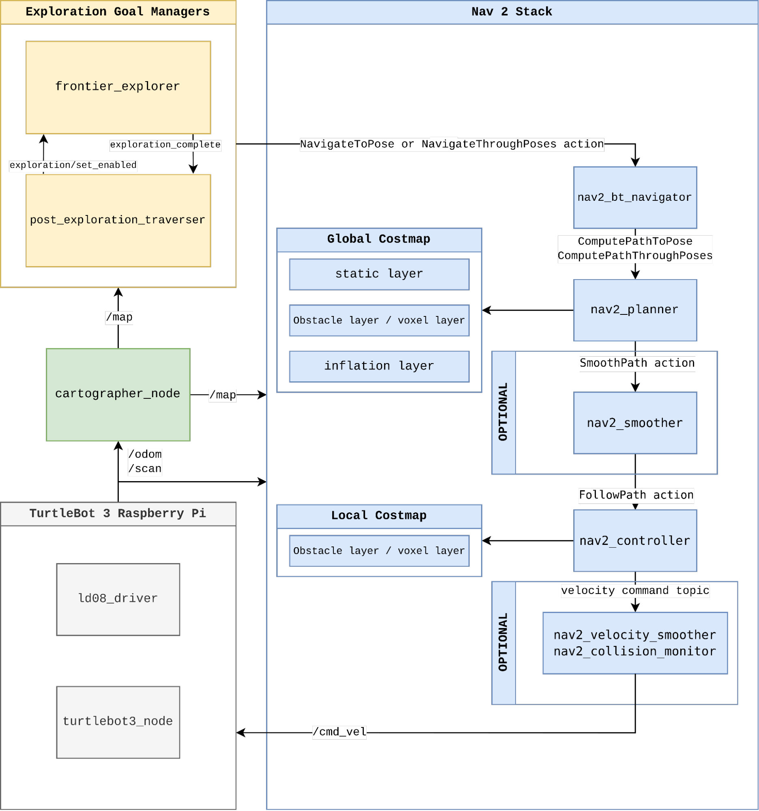
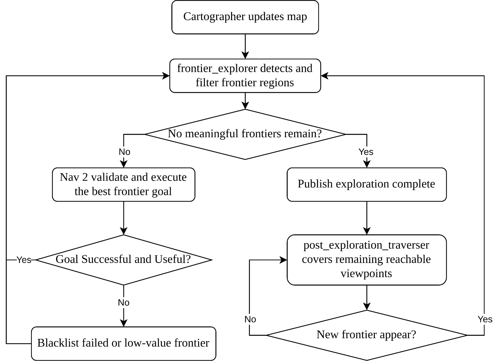

# Autonomous Exploration and Navigation Subsystem

[Home](../README.md)

### Overview

Our autonomous exploration and navigation stack is organised as a layered ROS 2 system rather than a single monolithic controller. Cartographer is responsible for online 2D SLAM and continuously publishes the occupancy grid and TF transforms required for navigation. Nav2 is responsible for global path planning, local trajectory control, costmaps, and recovery behaviours. On top of these, our custom `g3g_frontier_exploration` package determines where the robot should explore next and supervises exploration progress.

This separation of responsibilities was intentional. The exploration node does not attempt to solve low-level path planning or motion control by itself. Instead, it focuses on selecting meaningful exploration goals from the live occupancy grid, while Nav2 handles whether those goals are reachable and how the robot should move to them safely. Compared to a simpler nearest-frontier implementation, this architecture makes the system easier to tune, easier to debug, and more robust when exploration goals become stale, blocked, or unproductive.

At system bring-up, the `g3nav2` package launches Cartographer, Nav2, RViz, and the frontier exploration stack from a single top-level launch file. This satisfies the project objective of operating the robot through a unified ROS 2 software launch while keeping the software internally modular.

### Software Architecture

The navigation and exploration subsystem is composed of the following main components:

| Component | Package / Node | Primary Responsibility | Key Interfaces |
| --- | --- | --- | --- |
| SLAM | `cartographer_node` , `cartographer_occupancy_grid_node` | Build and update the 2D occupancy map during exploration | `/map` , `map -> odom -> base_link` TF |
| Navigation | Nav2 stack in `g3nav2` | Compute global paths, generate local trajectories, maintain costmaps, execute recovery behaviours | `NavigateToPose` , `ComputePathToPose` , costmaps |
| Frontier exploration | `frontier_explorer` in `g3g_frontier_exploration` | Detect frontiers, rank exploration candidates, dispatch exploration goals, detect exploration completion | `/map` , TF, `/exploration/current_goal` , `/exploration_complete` , `/exploration/set_enabled` |
| Post-exploration coverage | `post_exploration_traverser` in `g3g_frontier_exploration` | Continue traversing useful reachable free space after frontiers are exhausted | `/post_exploration/current_goal` , `/exploration_complete` , `/exploration/set_enabled` |

This modular decomposition differs from a software architecture where one high-level controller owns all exploration logic internally. In our system, the mission controller can remain focused on mission sequencing, while the exploration package exposes clear interfaces for enabling exploration, detecting completion, and handing control back when the map changes.

Exploration & Navigation Architecture

### Navigation Stack Design

For autonomous transit within the maze, we use the Nav2 stack configured in the `g3nav2` package. The global planner is `nav2_navfn_planner::NavfnPlanner`, and the local controller is the MPPI controller. The global and local costmaps both use laser-based obstacle marking and inflation layers to maintain clearance from walls and dynamic obstacles.

We selected this stack because it cleanly separates deliberation and control:

- Cartographer maintains the evolving map.
- The NavFn global planner computes a feasible route through known free space.
- The MPPI controller tracks the route smoothly while reacting to local obstacle costs.
- The frontier exploration node chooses where to go next, but does not directly command wheel motion.

Frontier exploration is not itself a path planner. It is a goal-generation layer that sits above Nav2. Once a frontier goal is selected, Nav2 is responsible for validating and executing the motion.

### Frontier Goal Selection

#### Design Rationale

A basic frontier strategy would simply choose the nearest cell on the known-unknown boundary and send it to Nav2. However, such a strategy tends to produce poor goals near wall leaks, narrow corners, unreachable pockets, or regions that have already stopped yielding useful map expansion. Our implementation therefore treats frontier selection as a filtering and ranking problem rather than a one-step nearest-neighbour lookup.

#### Frontier Extraction Pipeline

The `frontier_explorer` node runs a planning loop once the map, TF transform, and Nav2 action servers are available. During each planning cycle, the node performs the following steps:

1. Read the current occupancy grid and robot pose in the `map` frame.
2. Detect raw frontier cells, defined as free cells that border unknown cells.
3. Evaluate each candidate frontier cell using several local quality metrics.
4. Cluster valid frontier cells into connected frontier regions.
5. Select a representative goal cell for each cluster.
6. Ask Nav2 to compute a path to each candidate goal.
7. Rank the remaining candidates and dispatch the best one to Nav2.

#### Frontier Cell Quality Metrics

Each frontier cell is evaluated using several local metrics to reject poor candidates before they become goals:

| Metric | Purpose | Benefit |
| --- | --- | --- |
| Minimum free-neighbour count | Ensures the candidate is embedded in traversable space | Rejects thin or noisy frontier fragments |
| Maximum occupied ratio in a local window | Rejects cells that are too surrounded by obstacles | Reduces goals in tight corners or wall-adjacent leaks |
| Reachable unknown border count | Measures how much unknown space is actually connected to reachable free space nearby | Favors frontiers that are likely to expand the map |
| Unknown span estimate | Estimates whether the frontier opens into a meaningful unexplored region | Rejects single-cell leaks and tiny cracks |
| Clearance to occupied cells | Requires a minimum obstacle clearance around the candidate | Improves safety and Nav2 success rate |

These metrics make the frontier detector much more selective than a simple boundary scan. In particular, they help prevent the robot from repeatedly targeting insignificant unknown cells that do not lead to real exploration progress.

#### Cluster-Based Goal Selection

After filtering, the remaining frontier cells are clustered into connected frontier regions. A representative cell is then selected for each cluster. The default preference is the cell nearest to the cluster centroid, because this usually represents the frontier region better than an arbitrary edge cell. If the centroid-nearest cell is too close to the robot or fails validation, the node falls back to another valid cell within the same cluster.

This cluster-based design is important for two reasons. First, it prevents the robot from treating a large frontier band as many unrelated goals. Second, it supports cluster-level blacklisting and retry control, which helps the robot move on from repeatedly bad frontier regions rather than oscillating among neighbouring cells.

#### Goal Ranking and Dispatch

For each surviving frontier cluster, the node asks Nav2 to compute a path from the current robot pose to the candidate goal. Clusters without a valid path are rejected immediately. The remaining candidates are then ranked primarily by path length, with larger cluster size used as a secondary preference. The shortest feasible goal is then dispatched to Nav2 as the active exploration goal.

This is an important distinction from describing the algorithm as purely nearest-frontier. The implementation is better characterised as path-validated frontier ranking, because the final decision depends not only on geometric proximity but also on actual navigability through the current map.

### Recovery and Completion Logic

One of the main strengths of our exploration node is that it does not assume every issued goal is useful. Instead, it explicitly monitors failure, timeout, and low-value exploration outcomes.

#### Blacklisting and Retry Control

The node maintains temporary blacklists for frontier clusters that fail or become invalid. If Nav2 rejects a goal, if no path exists, or if the robot times out before reaching the target, that cluster is blacklisted for a time-to-live (TTL) duration. The node also tracks repeated failures and permanently marks clusters as exhausted after a configurable fail limit.

This prevents the robot from repeatedly sending itself to the same problematic region and makes exploration behaviour more stable over long runs.

#### Information Gain Check

Reaching a frontier physically does not necessarily mean the goal was useful. A frontier may still be a poor target if the surrounding unknown space does not decrease after arrival. To handle this, the node measures the amount of unknown space near the selected frontier before and after navigation. If the reduction in unknown cells is too small, the cluster is blacklisted even though Nav2 technically succeeded.

This mechanism is especially valuable in real maps with sensor occlusion, grazing views, and map noise, because it promotes frontiers that actually expand the explored area.

#### Encapsulation-Based Completion

A second challenge in frontier exploration is deciding when exploration is truly complete. A naive implementation would stop only when no frontiers remain. In practice, SLAM maps often contain tiny unknown pockets that are fully enclosed by occupied cells and no longer reachable from the robot's connected free-space component.

Our node therefore performs an encapsulation check on the free-space region connected to the robot. If this reachable component is enclosed and only borders a small number of tiny unknown holes, the node treats exploration as complete after several confirmation cycles. This avoids endless attempts to chase map artifacts that do not correspond to meaningful unexplored territory.

### Post-Exploration Traversal

Exploration completion in our system does not necessarily mean the robot stops moving immediately. After the frontier explorer publishes `/exploration_complete`, a second node called `post_exploration_traverser` becomes active. This node samples reachable free-space viewpoints and ranks them according to how much occupied structure and unknown space they can still observe, together with path cost and clearance.

The purpose of this stage is to improve residual map coverage and to move the robot through meaningful reachable space even after the primary frontier set has been exhausted. This is useful when a frontier-based strategy has already covered all large openings, but there are still beneficial observation positions inside the known free-space component.

An additional robustness feature is frontier reactivation. If the post-exploration traverser detects that meaningful frontiers have reopened, for example because a new map update revealed fresh unknown boundaries, it hands control back to the frontier explorer through the `/exploration/set_enabled` service. This makes the overall exploration architecture adaptive rather than strictly one-way.

Exploration Flow

### Tuning and Parameterisation

Both the navigation stack and the frontier exploration nodes are heavily parameterised so that behaviour can be adjusted without code changes.

#### Nav2 Parameters

The Nav2 configuration file defines the following important behaviours:

- Global and local costmap resolution
- Robot radius and inflation radius
- Obstacle-layer sensor ranges
- Global planner choice and tolerances
- MPPI controller limits, critics, and trajectory scoring

These parameters determine the robot's safety margin, path smoothness, and ability to move through narrow spaces reliably.

#### Frontier Exploration Parameters

The exploration configuration file defines the following important behaviours:

- Minimum frontier cluster size
- Minimum goal distance from the robot
- Frontier free-neighbour threshold
- Maximum occupied ratio near a frontier
- Reachable unknown-cell threshold
- Minimum frontier unknown span
- Candidate clearance radius
- Goal timeout duration
- Blacklist TTLs and cluster failure limit
- Information-gain radius and minimum information-gain threshold
- Encapsulation confirmation thresholds

Together, these parameters let us tune the trade-off between aggressive exploration and conservative, reliable goal selection.

The table below summarises the most important tunable parameters in our current navigation and exploration stack, together with their configured values and the practical effect of increasing them.

| Parameter | Meaning | Current value | Effect of increasing the value |
| --- | --- | --- | --- |
| `frontier_min_cluster_size` | Minimum number of frontier cells required for a cluster to be considered meaningful | 8 | Rejects more small frontier fragments, reducing noise but possibly missing narrow openings |
| `min_goal_distance` | Minimum allowed distance between the robot and a selected frontier goal | 0.8 m | Pushes goals farther away, reducing trivial nearby targets but making short local refinements less likely |
| `max_frontier_occupied_ratio` | Maximum allowed obstacle density around a frontier candidate within the local window | 0.45 | Accepts more cluttered frontier regions, increasing exploration aggressiveness but also risk of poor goals near walls |
| `candidate_clearance_radius` | Minimum local clearance required around a frontier candidate | 1 cell | Enforces safer stand-off from obstacles, but may reject valid frontiers in tight spaces |
| `goal_timeout_sec` | Maximum time allowed for a frontier goal before the node cancels and blacklists it | 15.0 s | Makes the explorer more patient with difficult paths, but slows recovery from genuinely bad goals |
| `min_information_gain_cells` | Minimum reduction in nearby unknown cells required to treat a reached frontier as useful | 2 cells | Requires stronger map expansion before a goal is considered successful, making the explorer more selective |
| `encapsulation_confirmation_cycles` | Number of consecutive enclosed-space detections required before exploration is declared complete | 3 cycles | Makes completion more conservative and less sensitive to transient map artifacts |
| `robot_radius` | Effective robot body radius used by Nav2 costmaps for collision checking | 0.10 m | Expands the robot footprint in planning, improving safety margin but reducing passage through tight gaps |
| `inflation_radius` | Costmap obstacle inflation distance around occupied cells | 0.35 m | Increases obstacle buffer and path clearance, but can make narrow corridors appear less traversable |

### Design Decisions and Rationale

| Decision | Rationale |
| --- | --- |
| Use Cartographer for online SLAM instead of a prebuilt static map | The arena is unknown at the start of the mission, so the robot must localise and build the map online during exploration. |
| Use Nav2 for path execution but not for frontier discovery | Frontier selection is a goal-generation problem, while Nav2 is better suited for path planning, control, and recovery once a goal is chosen. |
| Filter frontiers with multiple quality metrics instead of selecting the nearest raw frontier | This rejects noisy, unsafe, or low-value candidates and improves real-world exploration reliability. |
| Perform path validation before committing to a frontier | A frontier is only useful if it is reachable through the current map, so feasibility should be checked before dispatch. |
| Use cluster-level blacklisting and fail limits | This prevents oscillation around problematic map regions and reduces repeated failed goals. |
| Add an information-gain check after goal completion | Successful arrival is not enough; the goal should also contribute to map expansion. |
| Add encapsulation-based completion logic | This prevents endless exploration attempts caused by tiny unreachable unknown pockets. |
| Add a post-exploration traverser with frontier reactivation | This improves residual coverage and allows the system to recover gracefully if new frontiers appear after completion. |
