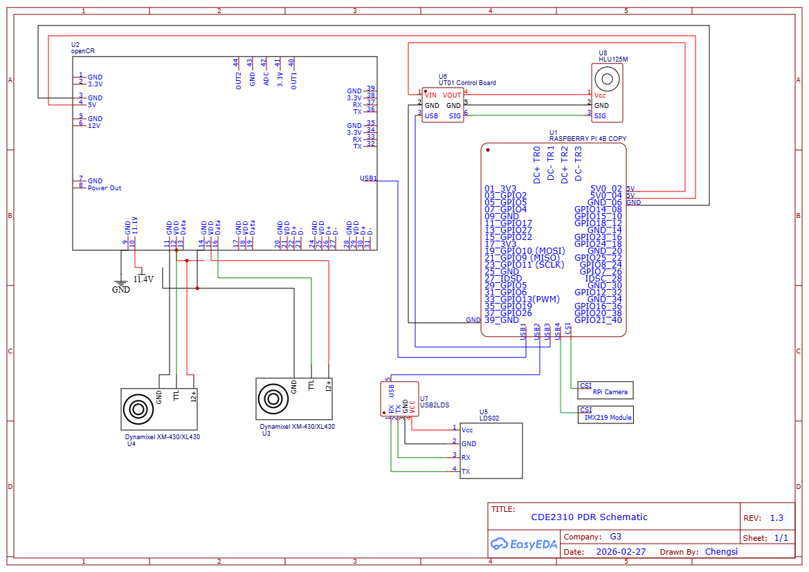
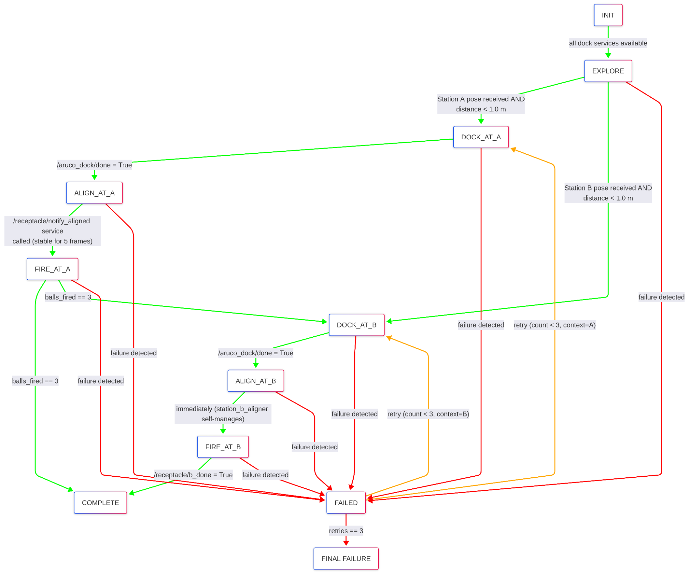

# High-Level Design

[Home](../README.md)

## Overall System Architecture

### Hardware and Electrical System Architecture

The robot hardware consists of a TurtleBot3 mobile base integrated with onboard compute, camera sensing, launcher actuation, and auxiliary electronics. Power and signal interfaces were distributed between the Raspberry Pi, OpenCR motor controller, and external actuator subsystems. The modular layout allowed independent subsystem development and replacement during testing.

### Software Architecture

The software system follows a modular ROS 2 node-based architecture. A central mission controller supervises the overall task flow, while specialised worker nodes perform perception, docking, alignment, exploration, and ball launching. Nodes communicate through ROS 2 topics and services, enabling each subsystem to be independently developed, tested, and replaced without redesigning the full system.

## Mission Logic Architecture Selection

An initial Behaviour Tree implementation using Groot2 and BehaviorTree.CPP was evaluated during early development. However, the final mission requirements were largely sequential, with limited need for behaviour interruption or dynamic replanning. The Behaviour Tree approach introduced additional development overhead, debugging complexity, and tooling instability relative to project timelines.

The team therefore migrated to a Python-based Finite State Machine (FSM), which provided faster implementation, deterministic execution, simpler debugging, and better suitability for the fixed competition task sequence.

## Mission Controller Design

### Overview

The mission controller (`mission_controller.py`) is the sole decision-making authority in the system. All other nodes, perception, alignment, and actuation, are stateless workers that respond to service calls or publish sensor data. The FSM runs at 10 Hz and coordinates the full delivery sequence across both stations without Nav2 navigation; instead, docking is achieved through a visual-servo approach (`simple_aruco_dock`) based on ArUco marker PnP pose.

### FSM Graph

States (in execution order): INIT → EXPLORE → DOCK_AT_X → ALIGN_AT_X → FIRE_AT_X → COMPLETE ↘ FAILED (retry loop)

High Level Mission Controller (FSM)

### Design Decisions & Rationale

| Decision | Rationale |
| --- | --- |
| No Nav2 for docking; visual servo instead | Nav2 requires a pre-built map. Visual servo directly uses ArUco pose. It is more reliable at short range and eliminates localisation error accumulation. |
| FSM at 10 Hz, not event-driven | Predictable tick rate simplifies timeout handling and avoids callback race conditions. State transitions are idempotent within a tick. |
| Station B fires autonomously (aligner owns /fire_launcher ) | Moving target timing cannot be pre-scheduled. The aligner uses LED rising-edge detection which is inherently reactive, the FSM cannot respond fast enough. |
| ROS 2 parameters for delays | Delays were specified by TA in Week 7. Using parameters avoids a code edit and restart during the 25-minute window. |

### Fault Handling and Robustness Strategy

The mission controller incorporates timeout detection, retry logic, and fallback transitions. If docking or alignment fails repeatedly, the affected station is skipped and the robot proceeds to remaining objectives where possible. This prevents total mission failure due to a single subsystem malfunction.
