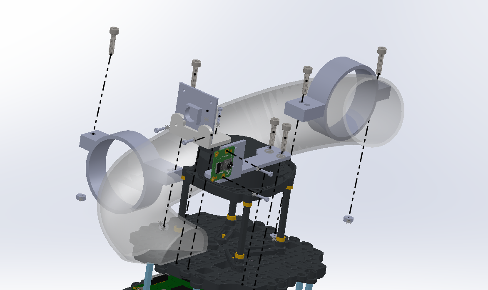
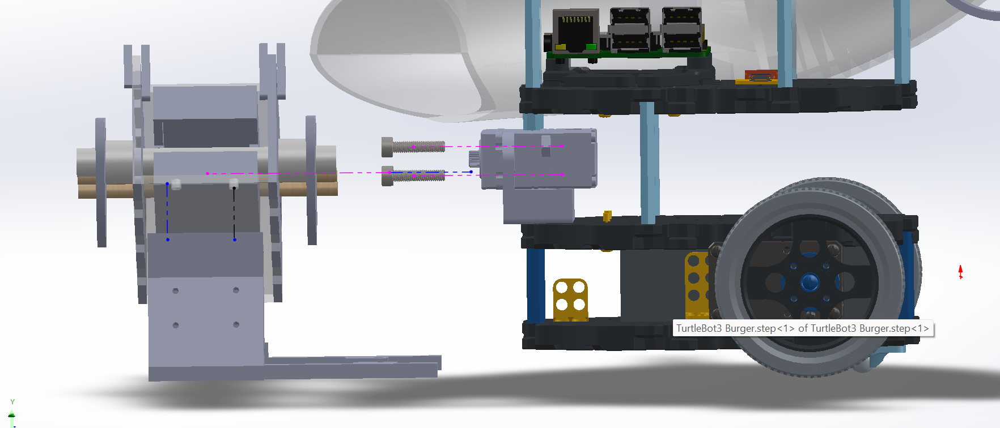

# Interface Control Document

[Home](../README.md)

## Mechanical Interfaces

Fig: Turtlebot Assembly Layer 4
 

Fig: Turtlebot Assembly Layer 1 & 2
 

**Interfaces**

| Component 1 | Component 2 | Connection via |
| --- | --- | --- |
| Turtlebot Layer 4 | USB Camera Mount | 2x M2 nut and bolts |
| Turtlebot Layer 4 | RPi Camera Mount | 2x M4 nut and bolts |
| Turtlebot Layer 4 | 2x Pipe Mount | 4x M4 nut and bolts |
| Turtlebot Layer 2 | UART Servo Mount | 2x M2 nut and bolts |
| Turtlebot Layer 3 | Servo Encoder | 2x M3 nut and bolts |
| Turtlebot Layer 1 | Launcher Mount | 4x M4 nuts |
| Launcher Mount | Launcher (Housing) | 4x M3 nuts |
| Launcher (Housing) | Launcher (Striker) | 2x dowels via friction fit |
| Launcher (Housing) | Launcher-Pipe Pins | Friction fit |
| Launcher-Pipe Pins | Pipe | 2x M2 self-tapping screws |
| Pipe | Pipe Cover | Superglue |
| UART Servo Mount | UART Servo Motor | 4x M3 nut and bolts |
| UART Servo Motor | Cam | Servo disc, fastened via 8x ~M1.8 screws |
| Cam | Shaft + Other Cam | Friction fit |
| USB Camera Mount | USB Camera | 2x M2 nut, bolts, washers |
| RPi Camera Mount | RPiCamera | 2x M2 nut, bolts, washers |

## Electrical Interfaces

| Component | Physical Connection | Connector on RPi | Power Source | Voltage | Communication Protocol | Data Rate | Device Node | Purpose |
| --- | --- | --- | --- | --- | --- | --- | --- | --- |
| JOHO UART Servo (Ball Launcher) | USB-to-UART adapter → USB-A into RPi | USB 2.0 port | RPi 5V GPIO (Pin 2/4) + GND (Pin 6) | 5V DC (powered from RPi power pins) | UART 8N1 via USB-to-TTL adapter | 115200 bps | /dev/servo | Ball launching motor (DC mode, CW, 100% PWM, 2.2s per ball) |
| IMX219 Camera Module | USB cable | USB 3.0 port | USB bus power | 5V DC | USB 2.0 UVC (video class) | 480 Mbps (HS) | /dev/video1 | ArUco marker detection for visual servo docking |
| RPi Camera (CSI) | 15-pin FFC ribbon cable | CSI camera port | CSI port | 3.3V DC | MIPI CSI-2, 2 data lanes | 320×240 BGR888 | — (libcamera) | Receptacle alignment (Hough circle). Mounted rotated 90° left. |
| LDS-02 LiDAR | 4-pin JST → USB2LDS → USB-A into RPi | USB 2.0 port | USB bus power | 5V DC | UART 8N1 over USB (CDC-ACM via USB2LDS) | 230400 bps | /dev/ttyUSB0 | 360° 2D laser scan (160–8000 mm, ~5 Hz) for SLAM + Nav2 |

## Software Interfaces

## Mission Controller ↔ Frontier Explorer

The frontier explorer is a standalone node extending BasicNavigator from nav2_simple_commander. It manages its own goal lifecycle using Nav2’s navigate_to_pose and compute_path_to_pose actions internally. The mission controller only controls the on/off switch. The explorer also has a post-exploration traverser that revisits interesting viewpoints after frontiers are exhausted.

| Interface | Type | Nodes / Direction | Trigger | Data Type | Description |
| --- | --- | --- | --- | --- | --- |
| /exploration/set_enabled | Service | mission_controller → frontier_explorer | INIT→EXPLORE (True), EXPLORE→DOCK (False), station complete→EXPLORE (True) | SetBool | True: clears cluster blacklists and failure counts, resets no-frontier and encapsulation counters, publishes exploration_complete=False, enables planning tick. False: cancels active Nav2 goal, clears active goal state, disables planning tick. Returns success=False if not ready (no map, no TF, no Nav2 servers). |
| /exploration_complete | Topic | frontier_explorer → mission_controller | No valid frontiers for 5 consecutive planning cycles, or encapsulation confirmed (3 cycles) | Bool | QoS: TRANSIENT_LOCAL. True signals map exploration is complete. FSM subscribes and logs but does not currently use this for state transitions — station detection via /station_a_pose and /station_b_pose drives the EXPLORE→DOCK transition. |
| /exploration/frontiers | Topic | frontier_explorer → RViz | Every planning tick (1 Hz) | MarkerArray | Visualization only. Cyan points for frontier cells, grey spheres for blacklisted goals, green sphere for active goal. Not consumed by FSM or any other node. |
| /exploration/current_goal | Topic | frontier_explorer → RViz | When new goal is sent to Nav2 | PoseStamped | Current exploration target pose for visualization. Not consumed by FSM. |
| /navigate_to_pose | Action | frontier_explorer → Nav2 BT Navigator | Best frontier selected by planning tick | NavigateToPose | Explorer calls goToPose() internally. Goal timeout: 15s (configurable). On failure: cluster blacklisted for 15s. After 3 failures: cluster permanently exhausted. |
| /compute_path_to_pose | Action | frontier_explorer → Nav2 Planner Server | Path feasibility check for each candidate frontier | ComputePathToPose | Explorer calls getPath() to verify a frontier is reachable before committing. Unreachable clusters are blacklisted for 15s. |

## Mission Controller ↔ Visual Servo

simple_aruco_dock operates in two modes: passive scanning during EXPLORE (publishes station poses on detection) and active PI-control docking during DOCK_AT_A/B (drives /cmd_vel toward the target marker). The mission controller toggles between modes via service calls.

| Interface | Type | Nodes / Direction | Trigger | Data Type | Description |
| --- | --- | --- | --- | --- | --- |
| /station_a_pose | Topic | simple_aruco_dock → mission_controller | Marker 42 detected during passive scan | PoseStamped | Camera-frame pose with distance in z. Published once per station until /aruco_dock/scan resets. FSM callback sets stations["A"]["found"] = True. |
| /station_b_pose | Topic | simple_aruco_dock → mission_controller | Marker 67 detected during passive scan | PoseStamped | Same as above for Station B. |
| /aruco_dock/dock_to_a | Service | mission_controller → simple_aruco_dock | FSM enters DOCK_AT_A | Trigger | Switches dock node from passive scanning to active PI approach toward marker 42. Includes post-turn and post-shift maneuvers after reaching target distance. |
| /aruco_dock/dock_to_b | Service | mission_controller → simple_aruco_dock | FSM enters DOCK_AT_B | Trigger | Same as dock_to_a but targets marker 67. |
| /cmd_vel | Topic | simple_aruco_dock → motor driver (RPi) | Every camera frame during APPROACHING state | TwistStamped | PI control output: angular.z from bearing error (KP=1.2), linear.x from distance error + integral (KP=0.5, KI=0.08). Max linear 0.02 m/s, max angular 0.05 rad/s. |
| /aruco_dock/done | Topic | simple_aruco_dock → mission_controller | Distance ≤ 0.30m AND bearing < 3° for 5 frames | Bool | True when docking approach + post-turn + post-shift complete. FSM only accepts during DOCK_AT_A/B states; stale messages in other states are ignored. |
| /aruco_dock/scan | Service | mission_controller → simple_aruco_dock | FSM leaves DOCK state | Trigger | Cancels active approach and post-dock maneuvers, returns to passive scanning, resets station_reported flags so poses can be re-published on next sighting. |
| /aruco_dock/marker_visible | Topic | simple_aruco_dock → mission_controller | Every camera frame | Bool | True if any known marker ({42, 67}) is visible in current frame. Passive monitoring signal. |
| /aruco_dock/marker_distance | Topic | simple_aruco_dock → mission_controller | Every frame with detection | Float32 | Raw solvePnP distance to active target marker in metres. |

## Mission Controller ↔ Station A Aligner

The station_a_aligner subscribes to the RPi CSI camera (/camera/image_raw/compressed, BEST_EFFORT QoS, depth=2). It detects the tin receptacle via Hough circle detection and drives the robot forward/backward using Y-axis P-control (camera is rotated 90°). The aligner owns /cmd_vel during ALIGN_AT_A. It notifies the FSM via a one-shot service call when stable alignment is achieved.

| Interface | Type | Nodes / Direction | Trigger | Data Type | Description |
| --- | --- | --- | --- | --- | --- |
| /aligner_a/set_enabled | Service | mission_controller → station_a_aligner | FSM entering / leaving ALIGN_AT_A | SetBool | True enables image processing and cmd_vel output. False resets all alignment state (EMA, stable count, notified flag) and stops cmd_vel. NOTE: current mission_controller.py does not call this — aligner must be enabled manually or the default changed. |
| /receptacle/offset | Topic | station_a_aligner → mission_controller | Every camera frame | Int32 | Y-axis pixel offset from frame centre (camera rotated 90°). 9999 when no circle detected. FSM logs for monitoring. |
| /receptacle/tin_ready | Topic | station_a_aligner → mission_controller | Every camera frame | Bool | True when \|offset_y\| < ALIGN_THRESHOLD (15px). Continuous signal, not latched. |
| /receptacle/notify_aligned | Service | station_a_aligner → mission_controller | 5 consecutive aligned frames (ALIGN_STABLE_FRAMES) | Trigger | Called once when stable alignment reached. FSM serves this — accepts only in ALIGN_AT_A state (returns success=True), rejects in any other state (returns success=False). On rejection, aligner resets notified flag and retries on next stable frame. |
| /cmd_vel | Topic | station_a_aligner → motor driver (RPi) | Every camera frame while enabled | Twist | linear.x only (Y-axis P-control: KP=0.0015, max 0.08 m/s). angular.z always 0. Publishes zero velocity when aligned or no circle detected. |
| /receptacle/annotated | Topic | station_a_aligner → Foxglove | Every camera frame | Image | Debug feed with Hough circle overlay, horizontal alignment lines, offset text, and stable frame counter. |
| /camera/image_raw/compressed | Topic | csi_cam → station_a_aligner | Camera rate (~30 Hz) | CompressedImage | Input feed. Camera is mounted rotated 90° left. |

## Mission Controller ↔ Station B Aligner

Station B operates differently from Station A. The station_b_aligner handles both alignment AND firing autonomously in two phases. Phase 1 (ALIGNING): Y-axis P-control identical to Station A. Phase 2 (FIRING): bot is stationary; aligner watches for blue LED via HSV thresholding and calls /fire_launcher directly on each rising edge. The FSM only waits for /receptacle/b_done.

| Interface | Type | Nodes / Direction | Trigger | Data Type | Description |
| --- | --- | --- | --- | --- | --- |
| /receptacle/b_done | Topic | station_b_aligner → mission_controller | All balls fired at Station B | Bool | True when balls_fired >= BALLS_TO_FIRE (1). Published every frame (not one-shot). FSM in FIRE_AT_B watches this to transition to COMPLETE or next station. |
| /fire_launcher | Service | station_b_aligner → ball_launcher_node | Blue LED rising edge detected (HSV threshold met for LED_CONFIRM_FRAMES) | Trigger | Station B aligner calls this directly — FSM does NOT fire for Station B. Called once per rising edge. Async non-blocking call with launcher_busy guard. |
| /cmd_vel | Topic | station_b_aligner → motor driver (RPi) | Every camera frame during Phase 1 (ALIGNING) | Twist | Phase 1: linear.x Y-axis P-control (KP=0.0015, max 0.08 m/s). Phase 2 (FIRING/DONE): frozen at (0, 0) — bot does not move while watching for LED. |
| /receptacle/offset | Topic | station_b_aligner → mission_controller | Every camera frame | Int32 | Same contract as Station A. Y-axis pixel offset, 9999 if no circle detected. |
| /receptacle/tin_ready | Topic | station_b_aligner → mission_controller | Every camera frame during Phase 2 | Bool | True when blue LED is detected inside circle (HSV H[100–130] S[180–255] V[200–255], pixel ratio > 0.10 for 30 consecutive frames). |
| /receptacle/annotated | Topic | station_b_aligner → Foxglove | Every camera frame | Image | Debug feed showing current phase, alignment lines, LED detection status (ON/off), hit counter, and ball count. |
| /camera/image_raw/compressed | Topic | csi_cam → station_b_aligner | Camera rate (~30 Hz) | CompressedImage | Input feed. Same physical camera as Station A aligner. |

## Mission Controller ↔ Ball Launcher

The ball launcher node runs on the RPi. It wraps a JOHO UART bus servo in DC motor mode (CW at 100% PWM for 2.2s per ball). The FSM manages Station A firing with timing delays; Station B firing is managed by the station_b_aligner directly.

| Interface | Type | Nodes / Direction | Trigger | Data Type | Description |
| --- | --- | --- | --- | --- | --- |
| /fire_launcher | Service | mission_controller → ball_launcher_node | FSM in FIRE_AT_A, per ball. Gated by: launcher_ready == True AND launcher_request_pending == False AND launcher_status == "idle" | Trigger | Returns success=True and spawns daemon thread: dc_rotate(CW, 100%) for 2.2s then dc_stop(). Returns success=False if status is not idle or serial link is down. |
| /launcher_status | Topic | ball_launcher_node → mission_controller | Continuous, 10 Hz timer | String | idle: ready for fire command. firing: motor spinning (2.2s duration). complete: shot done — FSM callback increments balls_fired and starts post-fire delay timer. error: serial link unavailable, 1 Hz reconnect timer active. |
| /stop_launcher | Service | ball_launcher_node | Manual emergency stop | Trigger | Sets _stop_requested Event, interrupts active fire thread, calls dc_stop() twice, resets status to idle. Safe to call when idle. |

## Nodes Launch Location

| Platform | Nodes | Peripherals |
| --- | --- | --- |
| Raspberry Pi | turtlebot3_bringup (rosbu) | LDS-02 LiDAR, Dynamixel motors |
| Raspberry Pi | usb_cam | IMX219 USB camera |
| Raspberry Pi | csi_cam | RPi CSI camera |
| Raspberry Pi | ball_launcher_node | JOHO Servo in Launcher Mechanism |
| Laptop (Docker) | Cartographer SLAM, Nav2 stack, frontier_explorer, post_exploration_traverser, simple_aruco_dock, station_a_aligner, station_b_aligner, mission_controller, foxglove_bridge | NIL |
