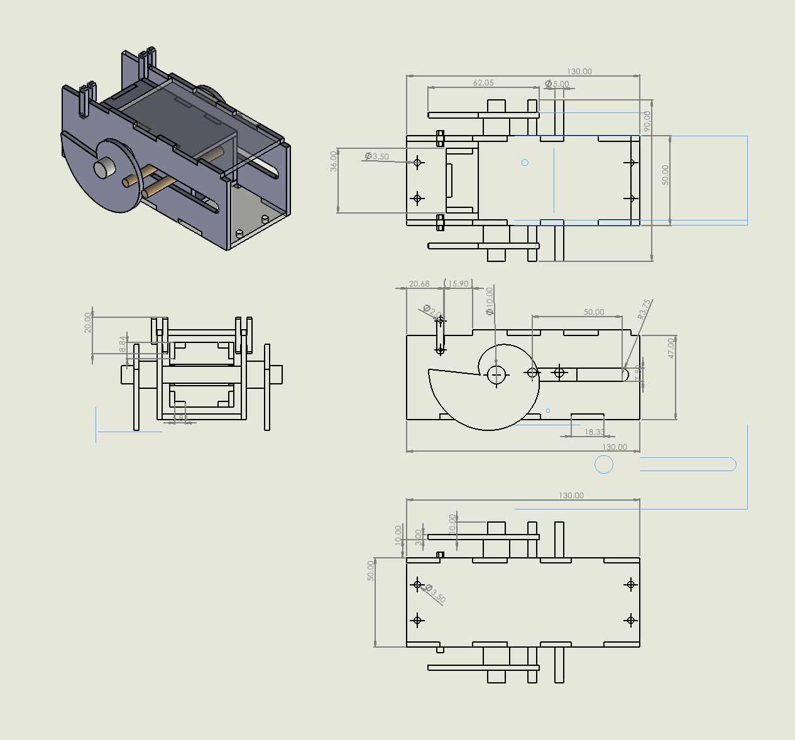
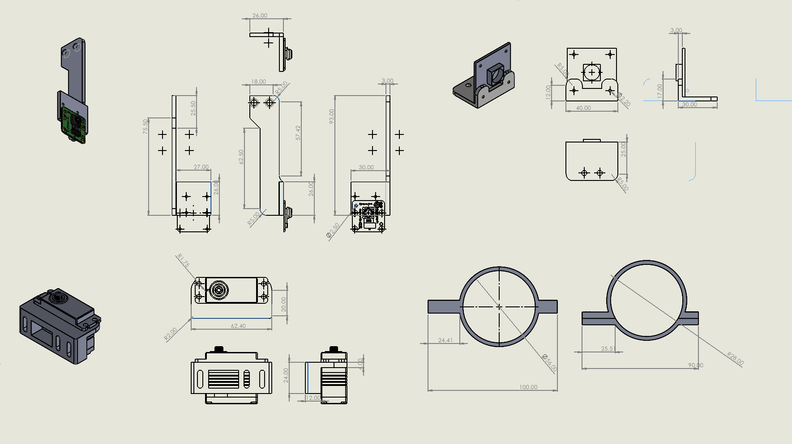

# Launcher & Servo Subsystem

[Home](../README.md)

The ball launcher uses a 25 kg-cm JOHO UART bus servo operated in DC motor mode, controlled by the `ball_launcher_node.py` in the `g3_ball_launcher` package. The node communicates with the servo over a USB-to-UART adapter at 115200 bps using a bundled Python SDK (`uart_sdk/`) that implements the JOHO packet protocol. On startup, the node sets the servo to DC mode (`MOTOR_MODE_DC = 0x00`), spins CW at low speed to find the init position (`CURRENT_POSITION = 4000`), then stops and reports idle. When /fire_launcher is called, a daemon thread calls `dc_rotate(CW, 100%)` to spin the motor at full PWM for 2.2 seconds, then `dc_stop()` to stop the motor. The status cycles through `idle → firing → complete → idle`, with the complete state held briefly so the mission controller can read it via the /launcher_status topic at 10 Hz. Thread safety is handled with two locks (`_lock` for status, `_serial_lock` for UART) and a `threading.Event` for stop requests.

Fig: Mechanical Subsystem Drawings
 
