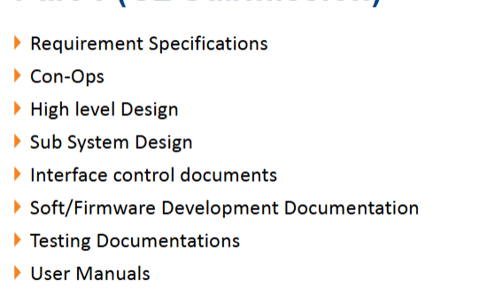

# Requirement Specifications

[Home](../README.md)

G2 Report

We are given 25 minutes to execute the mission, divided into 3 periods: Setup Period, mission period and End phase. In the setup period, we are to place the markers for identification, place the robot at the start zone, set up the computer and software, ensure ping pong balls are loaded, and any other necessary activities. We will also provide a user manual for the TA’s reference (FR). Upon activation, the robot shall autonomously leave the start zone for the maze zone (FR), where it is to map out the maze via its LIDAR sensor (FR) and detect landmarks for its operations (FR). There are 2 main Stations, A(static) and B(dynamic), both of which should be identified by our markers placed during setup, which the AMR should then align and orientate itself within docking tolerance (FR). It must hold at least 9 ping pong balls in order (TR) to execute its mission, unloading 3 balls (TR) into each station’s receptacle (including the bonus station). If an unloading error occurs, the robot may attempt to unload again. For Station A, the AMR should unload the balls in a fixed timing pattern (TR) into a FIXED collection receptacle of about 65mm in radius. For station B, the target unloading platform is mounted on a motorized linear rail, oscillating back and forth at a certain speed. Upon marker detection and identification, the AMR should track the motion profile and time its docking maneuver (FR). After unloading, the robot must proceed to the next zone or conclude. The official mission time will stop once the second unload is done. For the bonus task, the AMR must navigate to the lift lobby, Station C, via land-based QR markers and detect it, initiate an API call to summon the lift (FR), enter the lift safely once arrival is confirmed (FR), and emit the appropriate API command to travel to level 2 (FR), leaving the lift and navigating to Station D, which has a fixed receptacle for unloading. The team must remove all our material from the arena before the end of the 25 minutes at the end phase. Aside from mission-based scoring via payload delivery, we are also scored by time taken for payload delivery and map closure. Extra points are awarded for a single ROS2 launch file deployment and ROSBAG data recording.
