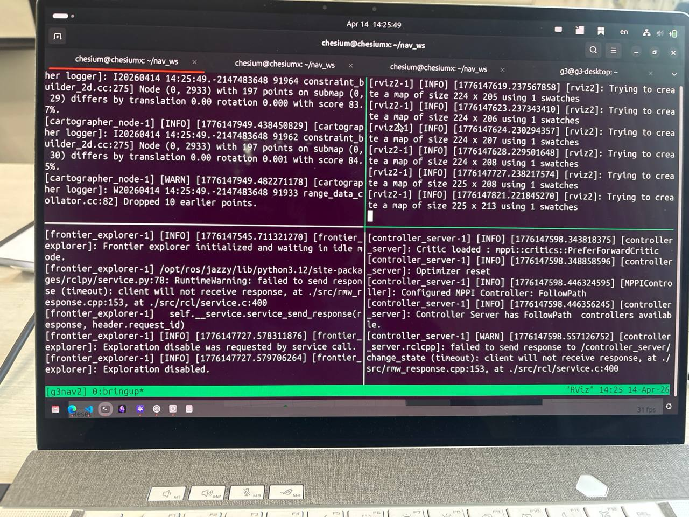
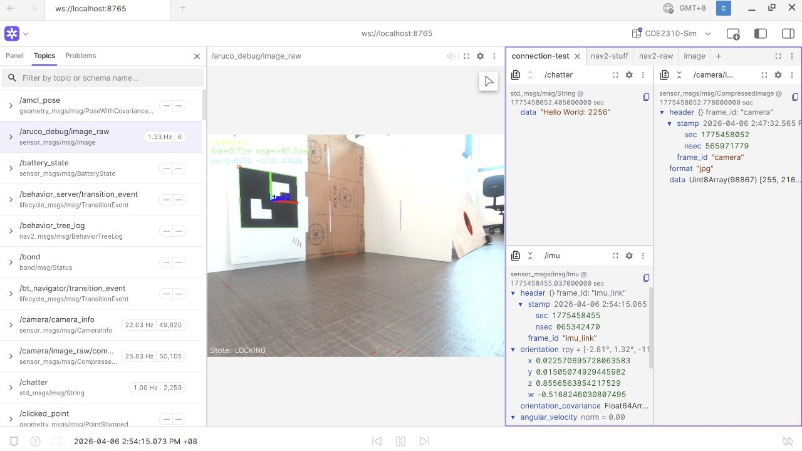

# Software Development Documentation

[Home](../README.md)

## ROS2 Packages and Nodes

| Subsystem | Package(s) | Nodes | Responsibility |
| --- | --- | --- | --- |
| Mission Control | g3_mission_control | mission_controller | FSM orchestrator: coordinates exploration, docking, alignment, and firing sequences across all other subsystems |
| Visual Servo | g3_visual_servo | simple_aruco_dock | ArUco marker detection (passive scanning + active PI-control docking), station pose publishing, post-dock turn/shift manoeuvres |
| Exploration | g3g_frontier_exploration | frontier_explorer | Frontier-based autonomous map exploration, post-exploration viewpoint traversal, and completion detection |
| Exploration | g3g_frontier_exploration | post_exploration_traverser | Frontier-based autonomous map exploration, post-exploration viewpoint traversal, and completion detection |
| Receptacle Alignment | g3_aligner | station_a_aligner | Hough circle detection and linear P-control to center on tin receptacle (Station A); HSV blue-LED reactive firing (Station B) |
| Receptacle Alignment | g3_aligner | station_b_aligner | Hough circle detection and linear P-control to center on tin receptacle (Station A); HSV blue-LED reactive firing (Station B) |
| Ball Launcher | g3_ball_launcher | ball_launcher_node | UART servo motor control for ball shooting, fire/stop services, status broadcasting |
| Navigation | g3nav2 | Cartographer, rviz, nav2 lifecycle nodes | Nav2 parameter configs, Cartographer SLAM, launch files for real hardware |
| Simulation | g3gzsim | Nav2, ros_gz nodes | Gazebo worlds, robot SDF model, ArUco marker models, sim-specific Nav2 params and launch files |

## Development Environment, Networking Strategy, and Debugging Workflow

The following section summarises the tools, workflows, and engineering conventions that we adopted during software development. These choices were shaped not only by convenience, but also by the practical realities of building a distributed ROS 2 system across a TurtleBot Raspberry Pi and an operator laptop. In our case, networking strategy, environment reproducibility, and debugging ergonomics had a direct impact on both developer productivity and system integration quality.

### Networking and System Configuration

At the beginning of the course, mobile-phone hotspots were suggested as the default networking method. In practice, we found this approach suboptimal for sustained software development and debugging. First, it required the phone to remain physically present and powered throughout testing, which made the connection fragile. Second, changing to a different hotspot was inconvenient because it often required reconnecting a monitor and keyboard to the Raspberry Pi in order to modify the network configuration manually. Third, the extra relay through a phone hotspot introduced additional latency and bandwidth limitations, which became especially noticeable when debugging high-bandwidth topics such as camera streams.

To address these issues, we modified the system configuration in several ways.

First, we installed Ubuntu Desktop on the Raspberry Pi instead of Ubuntu Server. This gave us a graphical interface when a monitor was attached, which made it much easier to configure networking. In particular, it allowed us to connect the Raspberry Pi to the campus NUS_STU Wi-Fi network, whose WPA2/PEAP authentication settings were significantly more difficult to manage purely from the command line.

Second, we configured the Raspberry Pi to connect by default to the always-available campus Wi-Fi and associated it with a dedicated Tailscale account. This meant that even when the laptop and Raspberry Pi were not on the same local network, we could still access the robot through Tailscale without first bringing up the operator hotspot. In practice, this was useful not only for SSH access, but also for file transfer, remote log inspection, and remote VS Code workflows. This significantly reduced the friction of routine development and debugging.

Third, because we were not able to establish a fully satisfactory ROS 2 communication path over Tailscale alone, we explored Husarnet as an alternative VPN-style service. Using Husarnet together with ROS_DISCOVERY_SERVER, we were able to bring up ROS 2 nodes remotely as a fallback debugging mode. However, its main limitation was bandwidth and latency when transmitting video streams, which made it unsuitable for smooth perception debugging. As a result, it was useful only as a backup solution rather than as our main workflow.

Finally, our preferred working configuration became connecting the Raspberry Pi directly to the operator laptop's Wi-Fi hotspot. In this setup, the laptop was typically given Internet access separately through Ethernet, while the Raspberry Pi first connected to NUS_STU at boot to ensure it could still be reached over Tailscale. Once connected, we could SSH into the Raspberry Pi and manually activate the laptop-hotspot connection using nmcli to establish the ROS 2 network. Compared to a phone hotspot, this approach removed one relay layer and gave us better latency and bandwidth for ROS traffic. This was not only a development configuration; it was also the final operational network topology that we used during deployment.

### ROS 2 Version and Development Platform

While experimenting with remote ROS debugging, we encountered references indicating that the ROS_DISCOVERY_SERVER workflow was not suitable for ROS 2 Humble in our use case. We also found in subsequent testing that ROS 2 Jazzy behaved more reliably for Gazebo installation and simulation. As a result, we standardised our software development on ROS 2 Jazzy.

To support development across different host platforms, including Ubuntu 22.04 and Windows WSL, we designed a Docker-based workflow for the software stack. This workflow was intended for development and simulation only. It allowed developers to set up a consistent environment without manually reproducing every dependency on their host machine, which significantly reduced onboarding friction and improved reproducibility across the team. For actual deployment on the robot, however, we chose to run the software stack natively on Ubuntu 24.04 for better compatibility and operational simplicity.

### Integration and Debugging Workflow

As the project matured, the number of interacting subsystems increased substantially. Running the entire system through a single long launch command became inconvenient when debugging, because it was difficult to isolate logs, restart individual components, or inspect failures in real time.

To improve this workflow, we created several tmux scripts that automatically opened a 2×2 panel layout and prefilled each pane with startup commands for different subsystems. The panes were grouped by subsystem rather than by machine or launch stage, which made the setup intuitive during integration. This gave us a lightweight but effective operator workflow: team members could bring up selected subsystems quickly, inspect logs side by side, and debug individual failures without losing visibility over the rest of the stack.

Panels opened by one of the tmux scripts, from top to bottom, left to right:

Cartographer, RViz, Exploration and Nav 2 Stack

### Visualisation and Runtime Monitoring

In addition to RViz, we also adopted Foxglove as a more modern dashboard platform for monitoring camera streams and other ROS 2 topics. Its tab-based layout was particularly useful because it let us maintain different dashboards for different debugging tasks, such as navigation, perception, and overall system monitoring. Compared to RViz, Foxglove made it much easier to build multi-panel layouts quickly and to inspect specific fields within structured ROS messages. This was especially helpful when switching repeatedly between subsystem-specific views during development.

A screenshot of our Foxglove dashboard
