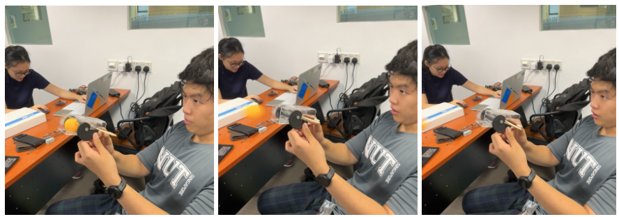
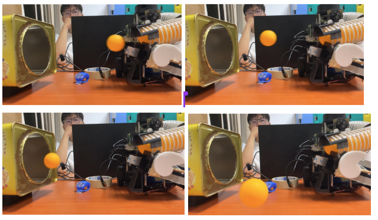
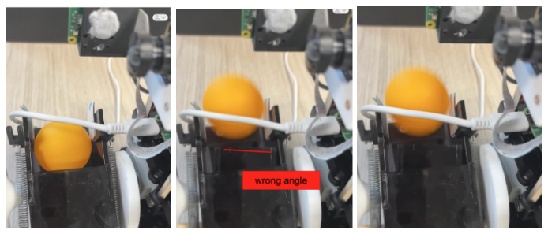
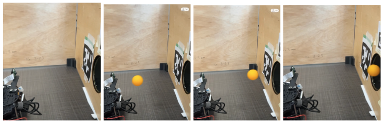
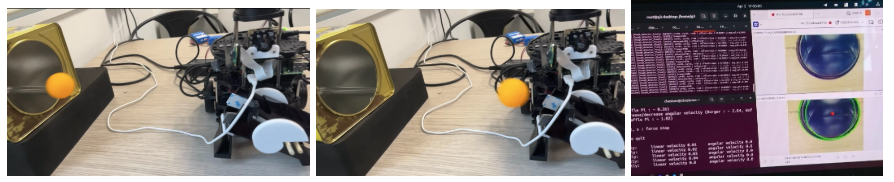
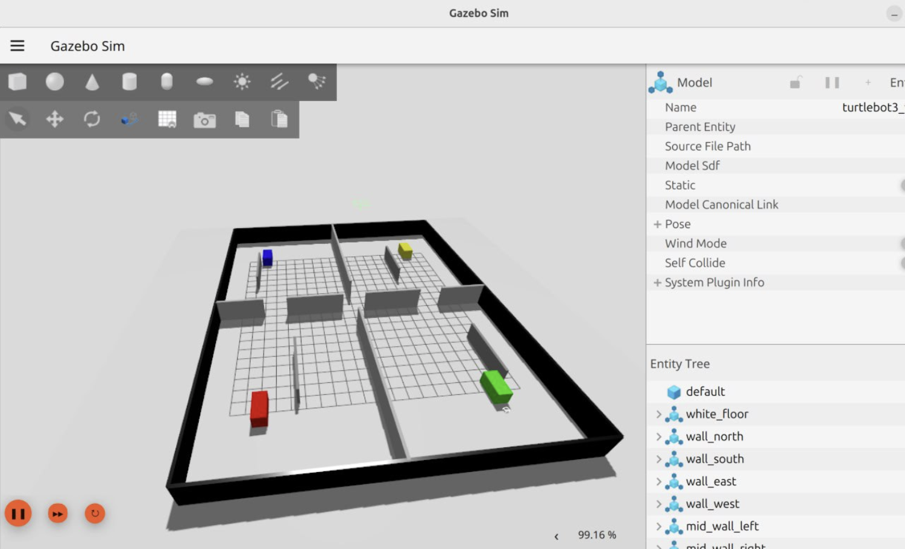
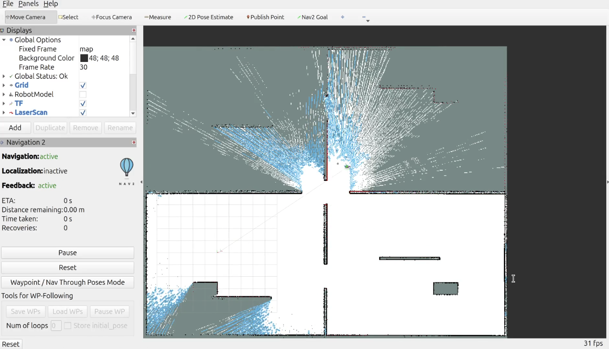

# Testing Documentation

[Home](../README.md)

(Before graded run, while preparing for the graded run)

## Launcher & Mechanical

Our servo’s physical functionality is limited due to its hardware inconsistency. Although the source code and documentation does provide the option to turn counterclockwise, which is completely possible in Servo Mode, we needed it to turn in DC mode in order to turn more than 1 full around, which the motor was not able to accomplish. Since the existing Cam was designed for the servo to rotate counterclockwise to load and launch the ball, we had to redesign and reprint the entire cam which added to additional overhead, proving that empirical observations and theoretical predictions can differ vastly.

## 1. Proof-of-concept Test

Aim: Establish cam mechanism as a viable method for shooting ping pong balls from 20-30cm away.

Outcome: successful

## 2. Isolated Test with Tin

Aim: Test ball shooting into tin.

Outcome: able to shoot into tin, but is inconsistent

Action: Conduct another test to identify the source of inconsistency. Then redo the isolated test.

## 3. Inconsistency Check Test

Aim: Identify source of inconsistency

Outcome:

Problem 1: Ball position is not constant in launcher

Problem 2: The two cams have uneven edges, which results in one cam giving way before another, causing the striker to strike the ball at an angle.

Problem 3 (identified after running the test again): Striker hits tape before hitting the ball, causing it to wobble and hit the ball at uniquely different angles.

Action:

Solution 1: Add tape to edges to add thickness and keep the ball in center

Solution 2: File one cam’s edge to make it consistent with the other

Solution 3: Moved tape closer to front of launcher, ensuring tape to be outside of sticker range of motion

## 4. Station A Test

Aim: Test ball shooting inside the maze tin

Outcome: Height of tin in maze was discovered to be higher than assumed in isolated tin test. The ball continuously hits the bottom edge of the tin.

Action: Change launcher angle and reconduct tests 2-4.

First test at original angle

Second test after increasing launcher angle

## 5. Alignment with Rpi Camera Integration Test

Aim: Test if launcher is accurate when Rpi camera detects hough circle

Outcome: Successful: repositioned cam until launcher shot accurately.

## Receptacle Alignment

### Station A

Test A-1 focused on Hough Circle parameter calibration. The objective was to determine suitable values for MIN_R, MAX_R, and PARAM2 across the required stand-off range of 22–38 cm. The robot was positioned at measured distances within this range while the aligner node was executed. Detected circle radii were observed through the annotated image feed and parameters were iteratively tuned until stable detection was achieved. Final values of MIN_R = 80, MAX_R = 150, and PARAM2 = 45 provided reliable receptacle detection while rejecting false circles from acrylic maze walls.

Test A-2 verified P-controller convergence performance. The robot was intentionally placed approximately 10 cm out of alignment before the Station A aligner was started. Time taken to achieve the ALIGNED condition and satisfy the stable-frame threshold was recorded. The controller converged in approximately 2 seconds at 30 cm distance with no observable oscillation.

### Station B

Test B-1 focused on HSV threshold calibration for blue LED detection. The LED target was powered while the side camera observed the moving receptacle. Hue, saturation, and value limits were adjusted until the detected area exceeded 200 px² when visible and remained below 20 px² when obscured. Final thresholds of H[100–130], S[180–255], and V[200–255] provided clean segmentation. Visible LED area typically ranged from 400–800 px², while obscured states remained below 10 px².

Test B-2 validated Phase 1 alignment to the circular cutout rather than the moving receptacle itself. With the receptacle placed at multiple positions, the aligner was run and the robot consistently locked onto the cutout centroid. Hough detection remained reliable within the 22–38 cm operating range and alignment was typically achieved within five stable frames.

Test B-3 verified the rising-edge trigger used for autonomous firing. The receptacle was manually moved past the cutout repeatedly while monitoring launch events. With LED_CONFIRM_FRAMES = 30, debounce logic successfully prevented double-triggering and each receptacle pass generated exactly one fire event.

AruCO visual docking[Arnav]

## Navigation and Exploration Test in Simulation

To preliminarily validate the logic of our frontier_exploration node, we initially used a Gazebo simulation environment. We downloaded the "simple_colored_warehouse" demo environment from the Gazebo website for debugging and resolved some core logical issues, such as the system recognising frontier blocks outside the walls and getting stuck in an infinite loop (solved by adding the Information Gain Check). However, recognising the significant differences between the simulation environment and real-world scenarios, we quickly shifted to testing on the real Turtlebot. During these tests, we also discovered that the large number of node processes launched by Cartographer and Nav 2-related commands could not always be completely terminated simply by pressing Ctrl-C. Residual nodes would sometimes interfere with subsequent tests. To address this, we devised a few one-liner commands to deactivate or kill the relevant nodes and created aliases for them, which greatly improved the efficiency of later navigation tests.

The simulator environment we used for the initial exploration test.

A screenshot of the map being displayed in the RViz in our initial exploration test. The blue cells are the frontiers identified by the explorer node.

## Cam and servo integration issues

Launcher, tested w power supply for understanding experimental voltage and current required, factor into power budget. Initially wanted to use a 5V DC to DC converter, learned that the power pins of rpi can fully support servo using 300 mA.

, must ensure param flags are correct
