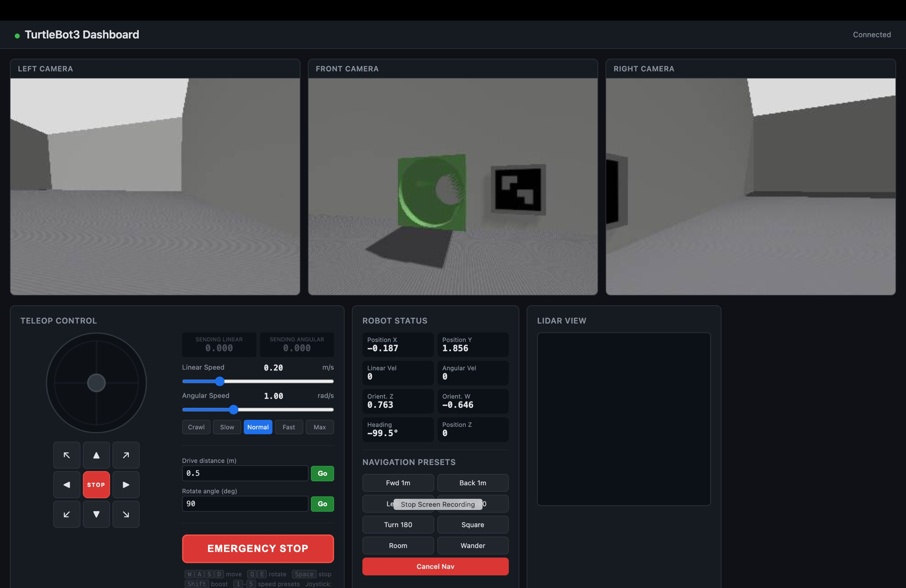
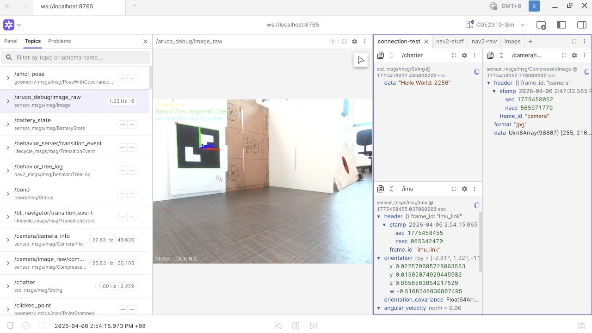
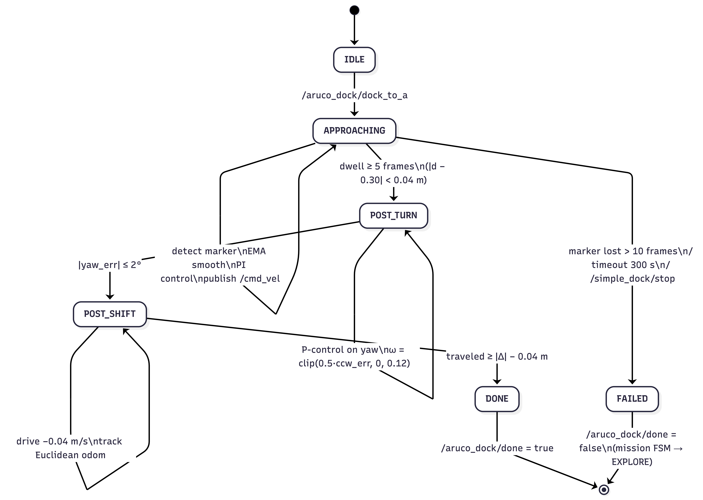
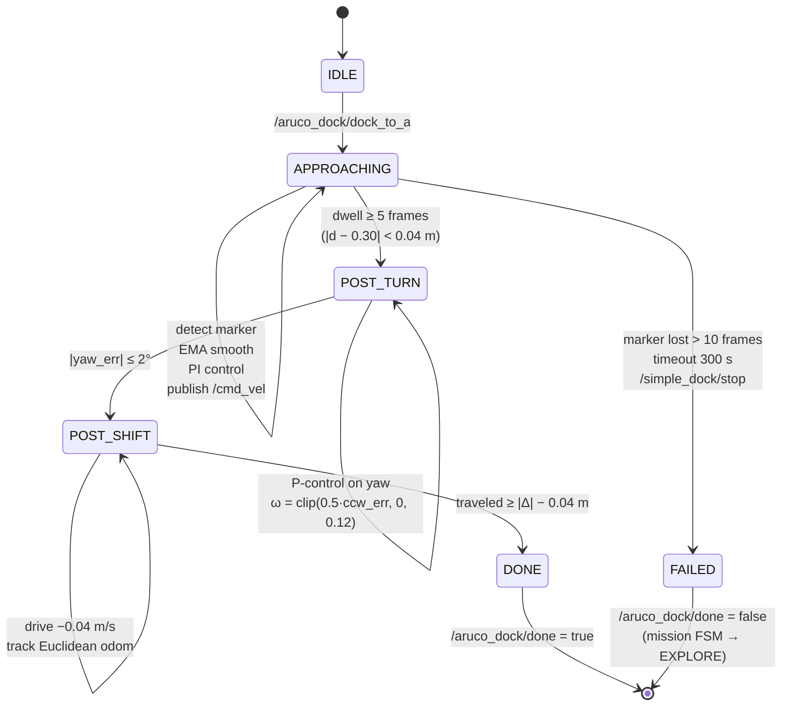

# Visual Servo and ArUco Docking Subsystem

[Home](../README.md)

## Overview

The docking subsystem is responsible for bringing the robot from a "marker detected somewhere ahead" state into a fixed, repeatable pose in front of each station so the launcher can engage the receptacle. It is implemented as a single ROS 2 node, `simple_aruco_dock.py` (`SimpleArucoDock`), in the `g3_visual_servo` package. The node does visual servoing directly from camera pixels to `/cmd_vel`, without Nav2 actions, TF lookups, or station frames — only the marker pose in the camera frame and a PI loop on top of it. A service call (`/aruco_dock/dock_to_a` or `/aruco_dock/dock_to_b`) triggers the approach; completion is reported on `/aruco_dock/done`.

### Docking Test Infrastructure

To tune parameters and verify the integration between docking and exploration, we built a lightweight custom dashboard used during early development. The dashboard streamed the left/front/right camera feeds, lidar view, and live odometry alongside a teleop joystick and navigation presets, which let us exercise the docking approach without having to bring up the full RViz/Nav2 stack.

*TurtleBot3 Dashboard — used for early-stage docking tests, with left/front/right camera feeds, teleop, and robot state alongside the ArUco marker visible in the front camera during approach.*

We later migrated to Foxglove for simulation and on-robot debugging, publishing annotations on a debug topic (`/aruco_debug`, plus a compressed debug image on `/aruco_debug/image_raw/compressed`) so that each stage of the docking FSM and every PnP detection could be visualised in real time. The debug image overlays the detected marker, the pose axes from `solvePnP`, and a live readout of distance, heading, and `tvec`, while a side panel shows the active docking state (e.g. `LOCKING`, `APPROACHING`, `POST_TURN`, `POST_SHIFT`).

*Foxglove debugging layout showing `/aruco_debug/image_raw` with PnP overlay (`dist=0.72 m, hdg=+62.2°, tvec=...`) and the live docking FSM state in the bottom-left corner.*

### Methods Considered

The docking approach went through two notable iterations:

1. **QR → ArUco fiducials.** An early prototype used QR code fiducials for station anchoring. We switched to ArUco markers because of their simplicity, faster detection, and lower computational overhead — the same rationale given in our ConOps and PDR documents.
2. **Nav2 docking (Week 12).** We briefly evaluated the Nav2 `opennav_docking` server, which would have provided collision-aware staging and tighter integration with the existing Nav2 stack. The scaffolding for this path still lives on the [`feat/nav2-docking`](https://github.com/Chesium/r2auto_nav_CDE2310/tree/feat/nav2-docking) branch — a `SimpleChargingDock` plugin wrapper ([`aruco_dock_node.py`](https://github.com/Chesium/r2auto_nav_CDE2310/blob/feat/nav2-docking/src/g3_visual_servo/g3_visual_servo/aruco_dock_node.py)), an ArUco pose publisher into the `map` frame ([`aruco_dock_pose_publisher.py`](https://github.com/Chesium/r2auto_nav_CDE2310/blob/feat/nav2-docking/src/g3_visual_servo/g3_visual_servo/aruco_dock_pose_publisher.py)), a `DockRobot` action client ([`dock_action_client.py`](https://github.com/Chesium/r2auto_nav_CDE2310/blob/feat/nav2-docking/src/g3_visual_servo/g3_visual_servo/dock_action_client.py)), bring-up launch files ([`aruco_dock.launch.py`](https://github.com/Chesium/r2auto_nav_CDE2310/blob/feat/nav2-docking/src/g3_visual_servo/launch/aruco_dock.launch.py), [`aruco_dock_hw_test.launch.py`](https://github.com/Chesium/r2auto_nav_CDE2310/blob/feat/nav2-docking/src/g3_visual_servo/launch/aruco_dock_hw_test.launch.py), [`nav2_docking_sim_test.launch.py`](https://github.com/Chesium/r2auto_nav_CDE2310/blob/feat/nav2-docking/src/g3gzsim/launch/nav2_docking_sim_test.launch.py)), tuned Nav2 parameters ([`g3_nav2_params.yaml`](https://github.com/Chesium/r2auto_nav_CDE2310/blob/feat/nav2-docking/src/g3nav2/config/g3_nav2_params.yaml)), and a mission FSM variant that drove the DockRobot action ([`nav2_mission_fsm.py`](https://github.com/Chesium/r2auto_nav_CDE2310/blob/feat/nav2-docking/src/g3_mission_control/g3_mission_control/nav2_mission_fsm.py)). However, OpenCR firmware and low-level communication issues consumed a large portion of the integration window. By the time the base was responding reliably to velocity commands, there was not enough time left to properly configure the dock plugin and tune its controller for our drivetrain. Rather than introduce a half-integrated dependency on the critical path, we committed to the direct ArUco visual-servo approach that we could build, tune, and debug end-to-end ourselves.

### Camera Implementation

The camera is an **IMX219-120 4-Lane 8 MP** MIPI CSI-2 module (Sony IMX219 sensor, 120° diagonal FOV wide-angle lens, ~0.66 W @ 3.3 V per the power budget). The wide FOV was important: it kept the ArUco marker inside the frame during the final close-range approach, where a narrower lens would have lost the marker just as the PI loop needed it most. The module is driven through `ros-jazzy-usb-cam` as a V4L2 source, publishing `sensor_msgs/Image` on `/usb_cam/image_raw` and `sensor_msgs/CameraInfo` on `/usb_cam/camera_info`. Because of the wide-angle distortion we ran a full intrinsic calibration with the standard `camera_calibration` checkerboard pipeline; the resulting `K` matrix and distortion vector are cached once in `_info_cb` and reused for `solvePnP`. Without this calibration the marker-distance estimate is biased by several centimetres — well over our 4 cm docking tolerance.

We use the 4×4 ArUco dictionary (`DICT_4X4_100`) with a physical marker size of 38 mm. Corner detection runs with subpixel refinement (`CORNER_REFINE_SUBPIX`, 5 px window, 30 iterations), because at 30 cm range a 1-pixel corner error translates into a noticeable bearing and distance error.

### Runtime Deployment

The docking node was run off-board on the host laptop rather than on the TurtleBot3's Raspberry Pi, with ROS 2 discovery handled by the **FastDDS Discovery Server** so the laptop and the Pi could reliably see each other's topics across the lab network. Two considerations drove this split:

- **Thermals on the Pi.** Running the full OpenCV + ArUco + PnP pipeline on the Raspberry Pi caused sustained CPU load and noticeable thermal throttling during longer test runs. Offloading the perception and control loop to the laptop kept the Pi cool enough to focus on `usb_cam`, `turtlebot3_bringup`, and the OpenCR bridge.
- **Image transport latency.** We measured the end-to-end latency of streaming `/usb_cam/image_raw` from the Pi to the laptop over the Discovery Server link and found it low enough (well under one control tick) that it did not meaningfully degrade the closed-loop docking performance.

The node itself was launched with a plain `ros2 run g3_visual_servo simple_aruco_dock`, which kept the iteration loop (edit parameter → restart → re-test) short during tuning.

### Detection and Pose Estimation

Each frame, `_image_cb`:

1. Converts the image with `cv_bridge` and grayscales it.
2. Runs `aruco.detectMarkers` once, splitting the result into two uses: a passive scan that republishes the station pose on `/station_a_pose` whenever a known marker is visible, and an active-approach branch that matches the commanded target ID.
3. Estimates pose with `cv2.solvePnP` using `SOLVEPNP_IPPE_SQUARE`, a solver designed for planar square markers that is faster and more stable than the generic iterative solver at close range.
4. Derives from `tvec`: bearing = `atan2(tx, tz)`, distance = `tz − camera_forward_offset` (the camera sits 8 cm ahead of `base_link`, so the controller stops the *robot*, not the *camera*, at 30 cm from the marker), lateral offset = `tx`, and marker-normal yaw from `cv2.Rodrigues(rvec)`.

### Control Algorithm

Inside the `APPROACHING` state, the control loop is:

- EMA smoothing (α = 0.3) on both bearing and distance so single-frame detection noise does not jerk the robot.
- Proportional angular control: `ωz = clip(−1.2 · bearing, ±0.05 rad/s)`.
- PI linear control on distance error: `Kp = 0.5`, `Ki = 0.08`, with anti-windup — the integrator advances only when the bearing is small (< 15°) and the output is not saturated. This prevents windup during the initial rotation when the robot is aligning but not yet driving.
- Output caps are deliberately tight: `max_linear = 0.02 m/s`, `max_angular = 0.05 rad/s`.

### Why We Chose Slow Docking

The tight speed cap is not cosmetic; it falls out of three hardware and perception constraints:

1. **Detection latency and EMA lag.** `usb_cam` delivers ~15 Hz, PnP adds a few ms, and the EMA is explicitly low-pass. Much faster than 2 cm/s and the robot overshoots before the smoothed distance catches up.
2. **Differential-drive deadband.** The TurtleBot's motors do not move reliably below roughly 0.015 m/s; a slightly higher ceiling gave us stick-slip where the robot would creep, stall, lurch, and repeat. The cap keeps the command just above the deadband.
3. **Stopping precision for the launcher.** Docking feeds directly into the ping-pong launcher, which needs the marker centred within a few centimetres. At 2 cm/s with a 4 cm tolerance, one controller tick of overshoot is within spec.

Completion requires the distance to be within tolerance for five consecutive frames (`dwell_frames = 5`), filtering out single-frame PnP spikes that would otherwise trigger a false DONE.

### Failure Handling

If the marker is lost briefly (< 3 frames) the robot coasts on the last command; between 3 and 10 frames it holds still; past 10 frames the approach fails. A 300 s timeout guards against deadlocks. On failure the node publishes `Bool(false)` on `/aruco_dock/done`; the mission controller uses this to reset back to `EXPLORE` rather than stalling.

### Post-Dock Sequence

Because the launcher is offset from the robot's front, the approach ends with a two-step alignment:

- **Post-turn** — rotate CCW so the marker normal ends up at −90° in the camera frame (wall on the robot's left). The turn magnitude is computed in the camera frame from `normal_yaw` and executed in the odom frame with a small P controller on yaw.
- **Post-shift** — after the turn the camera no longer sees the marker. The required shift is derived in closed form from the *remembered* pre-turn lateral offset and the turn angle:

  Δ = −x · sin(a) − r · (1 − cos(a))

  where `x` is the pre-turn lateral offset (`tvec[0]`), `a` is the turn angle, and `r` is the camera-to-base forward offset (0.08 m). Progress is tracked with Euclidean odom distance (not heading projection, which was brittle after the turn), stopping within a 4 cm tolerance.

Only after both post-steps complete does the node publish `done = true`, handing control back to the mission FSM.

### FSM Diagram

### Top-Level FSM

| # | State | Entered by | Actions | Exit condition | Next state |
| --- | --- | --- | --- | --- | --- |
| 1 | `IDLE` | Node startup or `/aruco_dock/scan` | Passive marker scan only; publish station pose when marker is seen | Service call `/aruco_dock/dock_to_a` | `APPROACHING` |
| 2 | `APPROACHING` | `_begin_approach()` resets EMAs, integrator, counters, timestamps | Detect target marker; EMA-smooth bearing & distance; run PI control; publish `/cmd_vel` | Dwell (5 frames within tolerance) → success; marker lost > 10 frames / 300 s timeout / stop service → failure | `POST_TURN` or `FAILED` |
| 3 | `POST_TURN` | Successful dwell in `APPROACHING` | 20 ms timer: P-controller on yaw toward `odom_yaw + a` | `\|yaw_err\| ≤ 2°` | `POST_SHIFT` |
| 4 | `POST_SHIFT` | Post-turn complete | 20 ms timer: drive backward at 0.04 m/s; track Euclidean odom distance | Traveled ≥ `\|Δ\| − 0.04 m` | `DONE` |
| 5 | `DONE` | Post-shift complete | Publish `Bool(true)` on `/aruco_dock/done` | — | Returns to `IDLE` on next service call |
| 6 | `FAILED` | Timeout / marker lost / stop | Stop robot; cancel post-timers | — | Publish `Bool(false)`; mission FSM returns to `EXPLORE` |

### Per-Frame Algorithm in `APPROACHING`

| Step | Operation | Key parameters / formula |
| --- | --- | --- |
| 1 | Receive `Image` on `/usb_cam/image_raw` | — |
| 2 | Convert to grayscale via `cv_bridge` | `bgr8 → GRAY` |
| 3 | Detect markers | `DICT_4X4_100`; subpixel refinement (5 px, 30 iter) |
| 4 | Passive scan — publish station pose when marker seen | `/station_a_pose` |
| 5 | Active detection — match target ID | `solvePnP` with `SOLVEPNP_IPPE_SQUARE`, marker size 38 mm |
| 6 | Compute measurements | `bearing = atan2(tx, tz)`; `distance = tz − 0.08`; `lateral = tx`; `normal_yaw` from `Rodrigues(rvec)` |
| 7 | Timeout check | Abort if elapsed > 300 s |
| 8 | EMA smoothing | α = 0.3 on bearing and distance |
| 9 | Dwell check (before control) | `\|d − 0.30\| < 0.04` or `d_raw ≤ 0.30` → `dwell_count++`; 5 in a row → DONE |
| 10 | Angular command | `ωz = clip(−1.2 · bearing, ±0.05 rad/s)` |
| 11 | Linear PI with anti-windup | `Kp = 0.5`, `Ki = 0.08`; integrate only if `\|bearing\| < 15°` and unsaturated; `vx = clip(PI, 0, 0.02 m/s)` |
| 12 | Hold if inside tolerance | If `d_ema ≤ 0.30 + 0.04`: `vx = ωz = 0`, reset integrator |
| 13 | Publish `/cmd_vel` (`TwistStamped`) | Frame `base_link` |
| 14 | Marker-loss policy | < 3 frames: coast; 3–10: stop & zero integrator; ≥ 10: FAIL |

### Post-Dock Sequence

| Stage | Purpose | Control loop (20 ms timer) | Completion |
| --- | --- | --- | --- |
| Post-turn | Orient wall to robot's left (marker normal → −90° in camera frame) | `ωz = clip(0.5 · ccw_err, 0, 0.12 rad/s)` toward `target_yaw = odom_yaw + a`, with `a = ccw_angle(normal_yaw, −90°)` | `\|yaw_err\| ≤ 2°` |
| Post-shift | Re-centre `base_link` on the marker after the turn | Drive at −0.04 m/s; track Euclidean odom distance | Traveled ≥ `\|Δ\| − 0.04 m`, where `Δ = −x·sin(a) − r·(1 − cos(a))`, `x = pre-turn tvec[0]`, `r = 0.08 m` |
| Publish done | Hand control back to mission FSM | `Bool(true)` on `/aruco_dock/done` | — |

### Key Parameters

| Parameter | Value | Meaning |
| --- | --- | --- |
| `marker_size` | 0.038 m | Physical side length of ArUco marker |
| `dictionary` | `DICT_4X4_100` | ArUco dictionary |
| `dock_distance` | 0.30 m | Target stop distance (robot to marker) |
| `dist_tolerance` | 0.04 m | Acceptable distance error |
| `camera_forward_offset` | 0.08 m | Camera optical centre ahead of `base_link` |
| `bearing_tolerance_deg` | 15° | Angular alignment tolerance |
| `dwell_frames` | 5 | Consecutive in-tolerance frames before DONE |
| `approach_timeout` | 300 s | Abort if not docked in time |
| `kp_angular / kp_linear / ki_linear` | 1.2 / 0.5 / 0.08 | Control gains |
| `max_linear / max_angular` | 0.02 m/s / 0.05 rad/s | Output caps (slow-dock policy) |
| `ema_alpha` | 0.3 | EMA smoothing factor |
| `lost_hold / lost_stop` | 3 / 10 frames | Marker-loss coast → stop → fail thresholds |
| `final_heading_offset_deg` | −90° | Target marker-normal angle after post-turn |
| `post_turn_speed / post_turn_kp` | 0.12 rad/s / 0.5 | Post-turn controller |
| `post_shift_speed / post_shift_distance_tolerance` | 0.04 m/s / 0.04 m | Post-shift controller |
