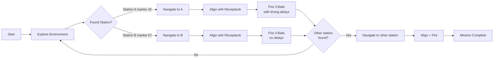

# CDE2310 Robot Project - Knowledge Base

> **NUS CDE2310** - Autonomous warehouse robot that explores, finds ArUco-marked stations, navigates to them, aligns with receptacles, and fires balls.
> 
> Platform: TurtleBot3 Burger | ROS 2 Jazzy | Gazebo Harmonic | Nav2

---

## Quick Links

| What | Where |
|------|-------|
| [[Architecture Overview]] | System design, data flow, node graph |
| [[ROS2 Topic and Service Map]] | Every topic, service, and action |
| [[State Machine Reference]] | FSM diagrams for all controllers |
| [[How to Run Everything]] | Build, sim, hardware, teleop |
| [[Package Index]] | All 7 packages explained |

---

## Package Map

```
src/
├── g3_mission_control/    → [[g3_mission_control]]  FSM orchestrator
├── g3_visual_servo/       → [[g3_visual_servo]]      ArUco detection + docking
├── g3g_frontier_exploration/ → [[g3g_frontier_exploration]]  Autonomous map exploration
├── g3_ball_launcher/      → [[g3_ball_launcher]]     UART servo motor control
├── g3gzsim/               → [[g3gzsim]]              Gazebo simulation + launch files
├── g3nav2/                → [[g3nav2]]               Nav2 config for real hardware
└── g3_receptacle_aligner/ → [[g3_receptacle_aligner]] Hough circle alignment
```

---

## The Mission (What This Robot Does)



### Station A (Static receptacle)
- ArUco marker ID: **42** (4x4_100 dictionary)
- Ball 1 -> **7s wait** -> Ball 2 -> **3s wait** -> Ball 3
- Alignment: Hough circle detection, linear P-control

### Station B (Moving receptacle)  
- ArUco marker ID: **67** (4x4_100 dictionary)
- Ball 1 -> Ball 2 -> Ball 3 (no delays)

---

## Key Concepts

- [[What is a Finite State Machine]] - How the mission controller works
- [[ArUco Markers Explained]] - How visual detection works
- [[Frontier Exploration Explained]] - How the robot explores unknown space
- [[Nav2 Basics]] - Navigation stack overview
- [[PI Control for Docking]] - How the closed-loop servo control works

---

## Current Status & Active Work

- Transitioning docking from legacy `aruco_dock_node.py` to Nav2's `opennav_docking` framework
- New `aruco_dock_pose_publisher.py` publishes to `/detected_dock_pose` for Nav2 docking server
- Simulation testbed: `nav2_docking_sim_test.launch.py`
