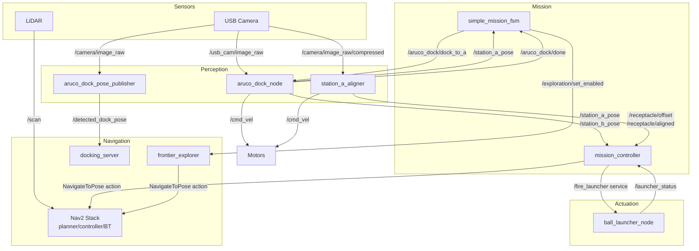

# Architecture Overview

## System Layers

```
┌─────────────────────────────────────────────────────┐
│                   MISSION LAYER                      │
│  mission_controller / simple_mission_fsm             │
│  (orchestrates the entire operation)                 │
├─────────────────────────────────────────────────────┤
│                 PERCEPTION LAYER                     │
│  aruco_dock_node     station_a_aligner               │
│  (camera → marker    (camera → Hough circle          │
│   detection + servo)  detection + P-control)          │
├─────────────────────────────────────────────────────┤
│                 NAVIGATION LAYER                     │
│  Nav2 stack          frontier_explorer               │
│  (path planning,     (autonomous exploration         │
│   obstacle avoid)     of unknown space)               │
├─────────────────────────────────────────────────────┤
│                  ACTUATION LAYER                     │
│  ball_launcher_node  /cmd_vel → motors               │
│  (UART servo for     (TurtleBot3 motor driver)       │
│   ball shooting)                                     │
├─────────────────────────────────────────────────────┤
│                  HARDWARE/SIM                        │
│  TurtleBot3 Burger   Gazebo Harmonic                 │
│  RPi + LiDAR + USB   (simulated world + sensors)     │
│  camera + servo                                      │
└─────────────────────────────────────────────────────┘
```

## Node Communication Graph



## Two Mission Controller Variants

### 1. `mission_controller.py` (Full competition FSM)
- Written by Daphne
- Handles: Explore -> Navigate -> Align -> Fire -> repeat
- Uses Hough circle alignment (`station_a_aligner`)
- Controls ball firing with timing delays
- 11 states, retry logic, full competition flow

### 2. `simple_mission_fsm.py` (Teaching/debug FSM)
- Minimal 4-state FSM: INIT -> EXPLORE -> DOCK -> DONE
- Coordinates frontier_explorer + aruco_dock_node
- Clean example of FSM design patterns
- Good for understanding the system without competition complexity

## Two Docking Approaches

### Legacy: `aruco_dock_node.py`
- Custom PI control loop
- Publishes `/cmd_vel` directly
- States: IDLE -> SCANNING -> APPROACHING -> DONE
- Triggered via `/aruco_dock/dock_to_a` service

### New (Nav2): `aruco_dock_pose_publisher.py` + `docking_server`
- Just publishes marker pose to `/detected_dock_pose`
- Nav2's `opennav_docking` handles the actual approach
- Uses `SimpleNonChargingDock` plugin
- Triggered via `/dock_robot` action

---

**See also:** [[ROS2 Topic and Service Map]], [[State Machine Reference]]
