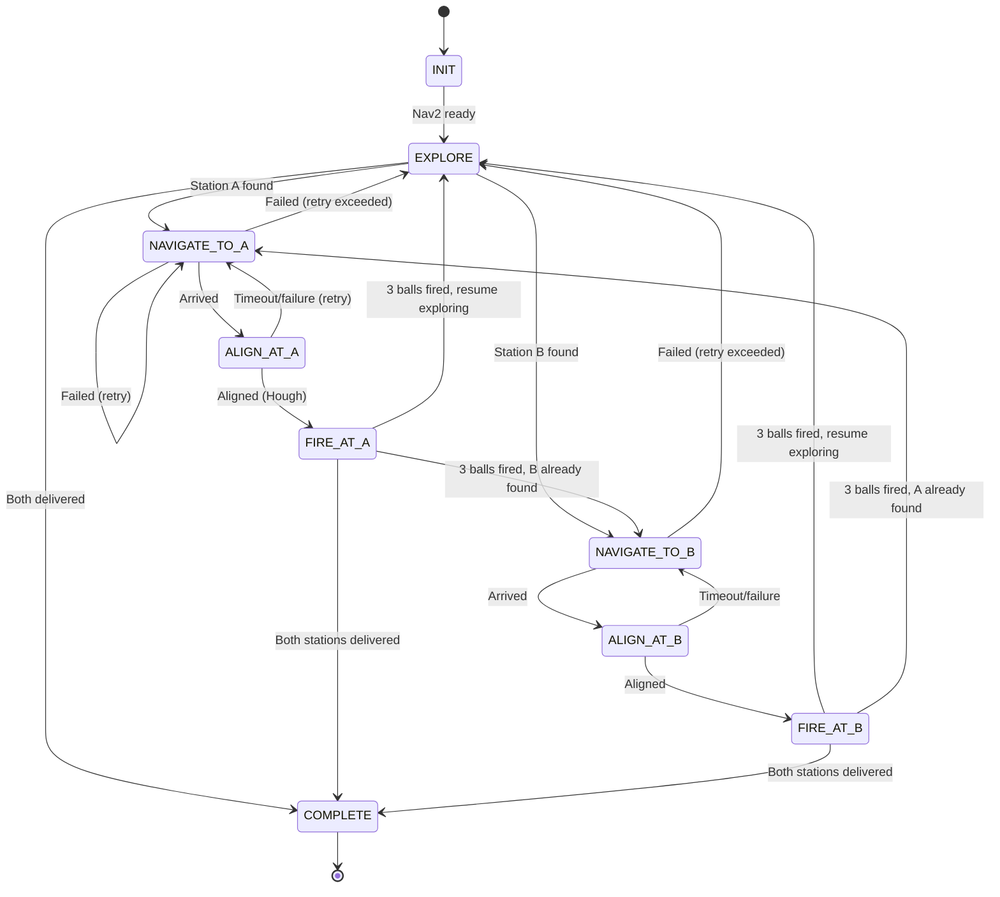
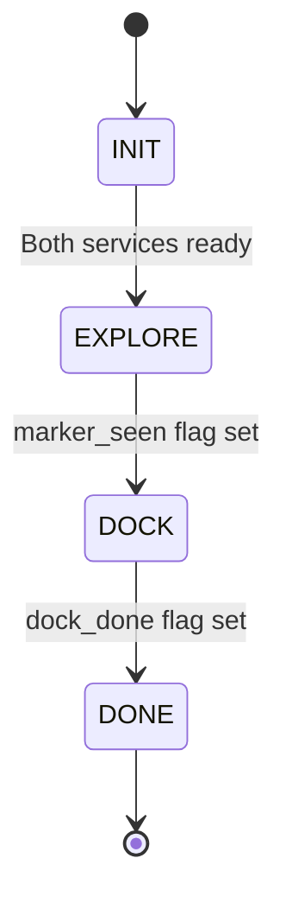
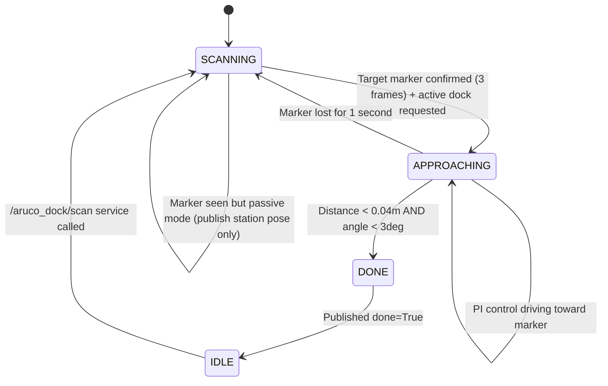
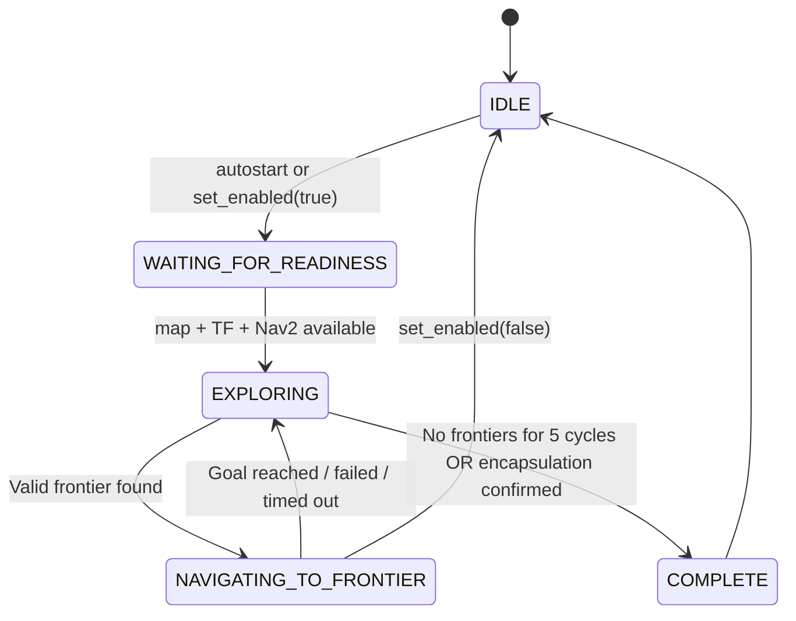

# State Machine Reference

## 1. Full Mission Controller (`mission_controller.py`)

Written by Daphne. This is the competition-ready FSM.

### State Details

| State | What Happens | Transitions |
|-------|-------------|-------------|
| **INIT** | Waits for Nav2 action server (5s timeout) | -> EXPLORE when ready |
| **EXPLORE** | Monitors `/station_a_pose` and `/station_b_pose` callbacks. Exploration node runs separately. | -> NAVIGATE_TO_A/B when station found |
| **NAVIGATE_TO_A/B** | Sends `NavigateToPose` goal to Nav2. Waits for async result. | -> ALIGN on success, retry or skip on failure |
| **ALIGN_AT_A/B** | `station_a_aligner` publishes `/receptacle/offset`, `offset_callback` runs P-controller on `/cmd_vel` at 30Hz. This handler monitors status. | -> FIRE when aligned, retry on timeout (10s) |
| **FIRE_AT_A** | Calls `/fire_launcher` service. Ball 1 -> 4.7s wait -> Ball 2 -> 0.7s wait -> Ball 3 | -> next station or EXPLORE |
| **FIRE_AT_B** | Calls `/fire_launcher`. Ball 1 -> Ball 2 -> Ball 3 (no delays) | -> next station or EXPLORE |
| **COMPLETE** | Logs results, stops robot. Keeps running for monitoring. | Terminal |

### Timing (Station A)
The delays account for the servo's 2.3s fire time:
- After Ball 1: 4.7s delay (total 7s gap)
- After Ball 2: 0.7s delay (total 3s gap)
- After Ball 3: no delay

### Retry Logic
- Max 3 retries per station
- On failure: re-navigate to same station
- After max retries: skip to other station or explore

---

## 2. Simple Mission FSM (`simple_mission_fsm.py`)

Teaching FSM. Clean, minimal, demonstrates proper patterns.

### Design Rules (Important!)
1. **Callbacks only WRITE variables** - never transition states
2. **All transitions happen in the 10Hz tick** - single point of control
3. **"On entry" actions are guarded by booleans** - run exactly once
4. **Service calls are fire-and-forget** (`call_async`) - tick never blocks

### State Details

| State | On Entry | Transition Condition |
|-------|----------|---------------------|
| **INIT** | Nothing | Both `/exploration/set_enabled` and `/aruco_dock/dock_to_a` services reachable |
| **EXPLORE** | Call `set_enabled(True)` | `_marker_seen` flag set by `/station_a_pose` callback |
| **DOCK** | Call `set_enabled(False)` + `dock_to_a()` | `_dock_done` flag set by `/aruco_dock/done` callback |
| **DONE** | Nothing | Terminal |

---

## 3. ArUco Dock Node (`aruco_dock_node.py`)

The legacy docking controller with PI control.

### PI Controller Parameters

| Parameter | Value | Purpose |
|-----------|-------|---------|
| KP_ANGULAR | 1.2 | Bearing correction gain |
| KP_LINEAR | 0.5 | Distance approach gain |
| KI_LINEAR | 0.08 | Integral gain for distance |
| MAX_LINEAR | 0.15 m/s | Speed cap |
| MAX_ANGULAR | 0.8 rad/s | Turn rate cap |
| DOCK_DIST | 0.30 m | Target stop distance |
| EMA_ALPHA | 0.3 | Exponential moving average smoothing |

### Lost Marker Handling
- Frames 1-3: Hold last command (coast)
- Frames 3-10: Stop moving
- Frames 10-30: Still stopped
- Frame 30+: Give up, return to SCANNING

---

## 4. Frontier Explorer

Not a traditional FSM, but has lifecycle states:

### Frontier Selection Algorithm
1. Detect frontier cells (free cells adjacent to unknown)
2. Filter by quality metrics (free neighbors, clearance, unknown span)
3. Cluster adjacent frontier cells (8-connected)
4. Filter by minimum cluster size (10 cells)
5. Check path feasibility via Nav2 `ComputePathToPose`
6. Rank by: path_length (shorter first), then cluster_size (bigger first)
7. Blacklist failed clusters with TTL expiry
