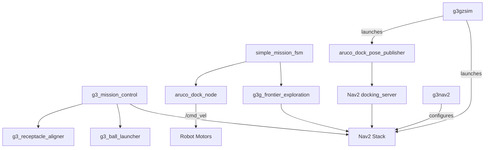

# Package Index

## All Packages at a Glance

| Package | Type | Build | What It Does |
|---------|------|-------|-------------|
| [[g3_mission_control]] | ament_python | `colcon build` | FSM orchestrator - runs the entire mission |
| [[g3_visual_servo]] | ament_python | `colcon build` | ArUco detection, visual servoing, docking |
| [[g3g_frontier_exploration]] | ament_python | `colcon build` | Autonomous map exploration |
| [[g3_ball_launcher]] | ament_python | `colcon build` | UART servo control for ball shooting |
| [[g3gzsim]] | ament_cmake | `colcon build` | Gazebo worlds, models, sim launch files |
| [[g3nav2]] | ament_cmake | `colcon build` | Nav2 config for real hardware |
| [[g3_receptacle_aligner]] | standalone scripts | N/A | Hough circle alignment (not a colcon pkg) |

## Dependency Graph



## Which Nodes Run Together?

### Simulation (Full Stack)
```
ros2 launch g3gzsim nav2full_test_launch.py
```
Launches: Gazebo + Nav2 + SLAM + frontier_explorer + simple_mission_fsm

### Simulation (Docking Test)
```
ros2 launch g3gzsim nav2_docking_sim_test.launch.py
```
Launches: Gazebo + Nav2 + SLAM + aruco_dock_pose_publisher

### Hardware (Competition)
Needs multiple terminals:
1. RPi: `rosbu` (robot drivers)
2. Laptop: SLAM + Nav2 + frontier_explorer
3. Laptop: mission_controller
4. Laptop: aruco_dock_node + station_a_aligner
5. Laptop: ball_launcher_node
6. Laptop: USB camera

### Hardware (Docking Only)
1. RPi: `rosbu`
2. Laptop: USB camera
3. Laptop: `ros2 run g3_visual_servo aruco_dock`
