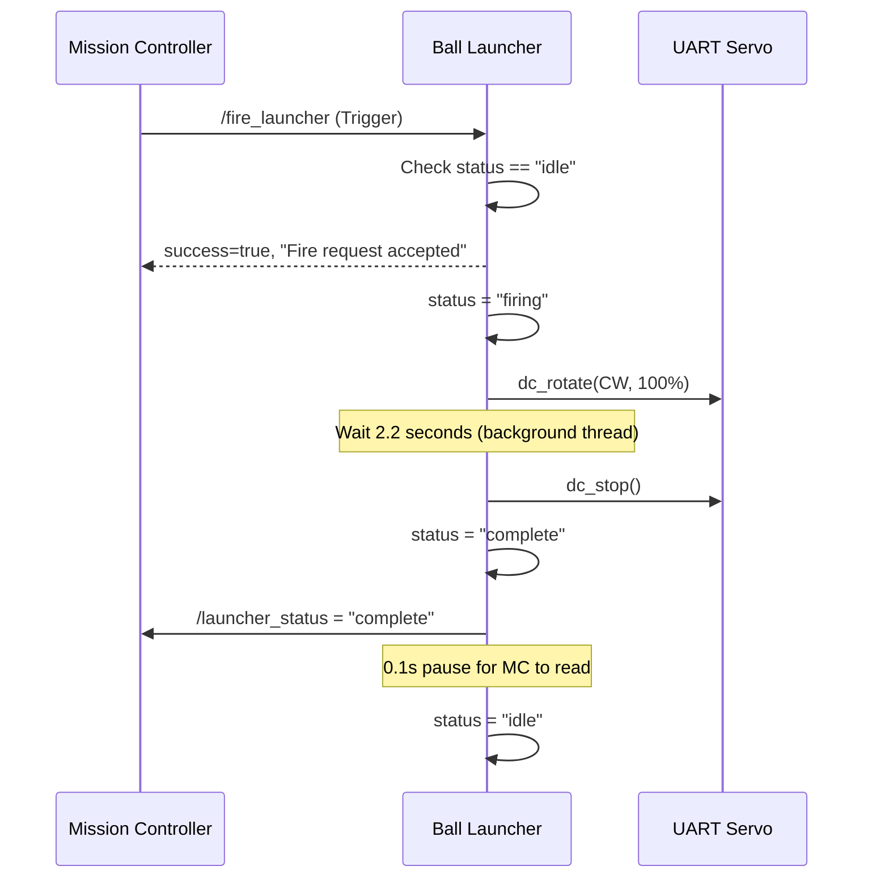

# g3_ball_launcher

> **Type:** `ament_python` package
> **Purpose:** Controls the physical ball-launching servo motor via UART serial

## Files

| File | Lines | Purpose |
|------|-------|---------|
| `ball_launcher_node.py` | ~260 | ROS2 node wrapping servo control |
| `uart_sdk/uart_servo.py` | | UART servo communication manager |
| `uart_sdk/packet.py` | | Serial packet encoding/decoding |
| `uart_sdk/data_table.py` | | Servo register definitions + constants |
| `uart_sdk/packet_buffer.py` | | Serial buffer management |

## How It Works

### Hardware
- **Servo**: Connected via USB-to-UART adapter (`/dev/ttyUSB0` at 115200 baud)
- **Motor mode**: DC mode (continuous rotation, not position servo)
- **Shooting**: Spin motor CW at 100% PWM for 2.2 seconds per ball

### ROS2 Interface

| Interface | Type | Purpose |
|-----------|------|---------|
| `/launcher_status` (pub) | String | Broadcasts state at 10Hz: "idle", "firing", "complete", "error" |
| `/fire_launcher` (service) | Trigger | Mission controller calls this to fire one ball |
| `/stop_launcher` (service) | Trigger | Emergency stop |

### Firing Sequence

### Thread Safety
- `_lock`: Protects `self.status` from concurrent read/write
- `_serial_lock`: Protects UART communications
- `_stop_requested`: `threading.Event` for safe interruption
- Fire runs in a **daemon thread** so it doesn't block ROS callbacks

### Error Recovery
- If serial connection fails, status goes to "error"
- A 1Hz timer (`_ensure_servo_connection`) retries connection
- If USB cable is replugged, node auto-reconnects

### Parameters

| Parameter | Default | Purpose |
|-----------|---------|---------|
| `servo_port` | `/dev/ttyUSB0` | USB serial port |
| `servo_baud` | 115200 | Baud rate |
| `servo_id` | 1 | Servo bus ID |
| `fire_duration` | 2.2 | Seconds to spin motor per shot |

### UART SDK

The `uart_sdk/` subdirectory is a bundled Python driver for the servo:
- `data_table.py` defines motor modes (`MOTOR_MODE_DC`, `MOTOR_MODE_SERVO`) and directions (`DC_DIR_CW`)
- `uart_servo.py` provides `UartServoManager` with methods like `dc_rotate()`, `dc_stop()`, `torque_enable()`
- Communication uses custom packet protocol over serial

---

**See also:** [[g3_mission_control]] (the node that calls `/fire_launcher`)
