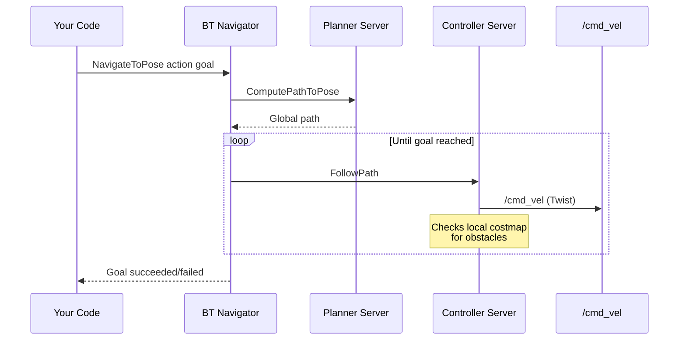

# Nav2 Basics

## What is Nav2?

Nav2 (Navigation2) is ROS 2's official navigation framework. It handles:
- **Path planning**: Finding a collision-free path from A to B
- **Path following**: Driving along the planned path
- **Obstacle avoidance**: Reacting to new obstacles in real-time
- **Recovery behaviors**: Getting unstuck (backup, spin, wait)
- **Behavior trees**: Orchestrating complex navigation tasks

## Key Nav2 Nodes Used in This Project

| Node | What It Does |
|------|-------------|
| `planner_server` | Global path planning (NavFn or Smac) |
| `controller_server` | Local path following (DWB or MPPI) |
| `bt_navigator` | Behavior tree execution |
| `behavior_server` | Recovery behaviors (spin, backup, wait) |
| `velocity_smoother` | Smooths velocity commands |
| `collision_monitor` | Emergency stop if obstacle too close |
| `slam_toolbox` or `cartographer` | Builds the map while navigating |
| `docking_server` | Autonomous docking (Nav2 plugin) |

## How Navigation Works



## How This Project Uses Nav2

### 1. Mission Controller (NavigateToPose action)
```python
self.nav_client = ActionClient(self, NavigateToPose, "navigate_to_pose")
# Send goal asynchronously
send_goal_future = self.nav_client.send_goal_async(goal_msg)
# Wait for result via callback
send_goal_future.add_done_callback(self.nav_goal_response_callback)
```

### 2. Frontier Explorer (BasicNavigator wrapper)
```python
# Inherited from nav2_simple_commander
self.goToPose(goal_pose)          # Send navigation goal
self.getPath(start, goal)          # Plan path (for feasibility)
self.isTaskComplete()              # Check if navigation finished
self.getResult()                   # Get success/failure
self.cancelTask()                  # Cancel current goal
self.clearAllCostmaps()            # Reset costmaps after failure
```

### 3. Docking Server (DockRobot action)
```bash
ros2 action send_goal /dock_robot nav2_msgs/action/DockRobot "{...}"
```
The `SimpleNonChargingDock` plugin:
- Navigates to a staging pose (offset from dock)
- Reads `/detected_dock_pose` for the dock's position
- Drives to the dock using its own controller

## Costmaps

Nav2 uses two costmaps:
- **Global costmap**: Full map, used for path planning
- **Local costmap**: Small area around robot, used for obstacle avoidance

Both are built from:
- Static map (from SLAM)
- LiDAR scans (dynamic obstacles)
- Inflation layer (safety buffer around obstacles)

## SLAM (Simultaneous Localization and Mapping)

This project uses **Cartographer** for SLAM:
- Builds a 2D occupancy grid from LiDAR scans
- Simultaneously tracks robot position in the map
- Publishes `/map` (OccupancyGrid) and `map -> odom` TF transform

### TF Tree
```
map -> odom -> base_link -> [lidar_link, camera_link, ...]
 │       │
 │       └── Published by wheel odometry
 └── Published by SLAM (corrects drift)
```

## Important Parameters

| Parameter | Our Value | Purpose |
|-----------|-----------|---------|
| `robot_radius` | 0.12 m | TurtleBot3 Burger footprint |
| `inflation_radius` | 0.3 m | Safety buffer |
| `max_vel_x` | 0.22 m/s | Max forward speed |
| `max_vel_theta` | 2.84 rad/s | Max turn speed |
| `source_timeout` | 1.0 s | LiDAR data freshness (hw) |

---

**See also:** [[Architecture Overview]], [[How to Run Everything]]
